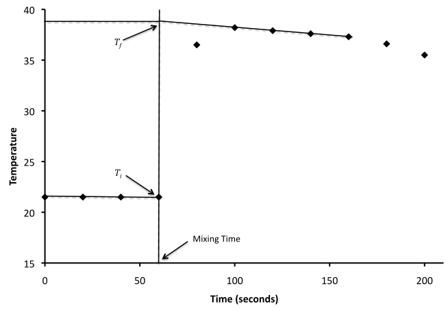

# Enthalpy of Reaction and Hess's Law

[(Back to home page)](index)

* TOC {:toc}

## Introduction 

The goal of this experiment is to investigate applications of the First Law of Thermodynamics, which states that the energy of a system is fixed and independent of the method of preparing the system or attaining the energy. Chemical reactions and changes of state involve a change in internal energy ($$\Delta  U$$). The amount of this energy change depends on the amount of materials present, and on the energy difference between the initial and final states (starting materials and products) of the reaction, but not the path through which the changes takes place. For a process, the change in internal energy is

$$\Delta U = q + w \tag{1}$$

where $$q$$ is heat (energy change due to thermal energy) and $w$ is work (energy change due to pressure-volume work). At constant-volume, no work is done and all of the energy change is accomplished through heat:

$$\Delta U = q_v \tag{2}$$

where $$q_v$$ is the constant-volume heat. At constant-pressure, the work done is $$w=-P\Delta V$$ and the total change in internal energy is

$$\Delta U = q_p - P \Delta V \tag{3}$$

where $$q_p$$ is the heat at constant-pressure. The heat at constant-pressure per mole of reaction is the molar enthalpy of reaction, $$\Delta H$$:

$$\Delta H = \frac{q_p}{n} \tag{4}$$

where $$n$$ is the number of moles of reaction. [Equation 4](#eqn:enthp) implies that, at constant-pressure, the change in enthalpy of a system is equal to the amount of heat released or absorbed per mole of reaction. In an exothermic reaction, where $$\Delta H < 0$$, heat will be released from the system to the surroundings and in an endothermic reaction, where $$\Delta H > 0$$, the system absorbs heat from the surroundings.

### Calorimetry 

We can experimentally determine heats of reaction using a device called a calorimeter, which in our case will consist of two nested Styrofoam coffee cups (a "coffee-cup calorimeter"). As Styrofoam is an excellent insulator of heat, very little heat will be transferred from the contents of the cup to the surrounding air. We are then justified in treating the contents of the cup as an isolated system -- one that transfers neither matter nor heat to the surroundings. For such a system, the total heat change must be zero:

$$q_{_{\rm rxn}} + q_{_{\rm surr}} = 0 \tag{5}$$

where $$q_{_{\rm rxn}}$$ is the heat of the reaction (system) and $$q_{_{\rm surr}}$$ is the heat of the surroundings. In other words, if the reaction generates heat then the contents of the cup will warm up, likewise if the reaction absorbs heat the contents of the cup will cool down.

Heat of a reaction cannot be measured directly so experimentally we measure the heat of the surroundings,

$$q_{_{\rm surr}} = m_{_{\rm surr}}c_{_{\rm surr}}\Delta T_{_{\rm surr}} \tag{6}$$

where $$\Delta T_{_{\rm surr}} = T_{\rm final}-T_{\rm initial}=T_f-T_i$$ is the change in temperature of the surroundings (in $$^\circ {\rm C}$$ or ${\rm K}$), $$m$$ is the total mass of the surroundings (solutes and solvents), and $$c_{_{\rm surr}}$$ is the specific heat capacity of the surroundings[^1]. The specific heat capacity is defined as the amount of energy needed to raise one gram of a substance by one Kelvin (units: $${\rm Jg^{-1}K^{-1}}$$). As the calorimeter is open to the atmosphere, the condition of constant-pressure is satisfied. Consequently, the change in enthalpy is computed as

$$\Delta H = \frac{q_{_{\rm rxn}}}{n} \tag{7}$$

where $$n$$ is the number of moles of substance reacting and the units of the change are kJ/mole.

[^1]: For most of our work, we will assume that the contents of the calorimeter are *mostly* water, and $$c_{\rm H_2O} = 4.184 \,{\rm Jg^{-1}K^{-1}}$$ can be used instead of the heat capacity of the solution.

The above analysis does not, however, take into account the heat absorbed by the calorimeter itself. Though these devices are designed to minimize the absorption or transmittance of heat, it is necessary to modify [equation 5](#eqn:firstlaw) to compensate for these effects:

$$q_{_{\rm rxn}} + q_{_{\rm surr}} + q_{_{\rm cal}} = 0 \tag{8}$$

where $$q_{_{\rm cal}}=C_{\rm cal}\Delta T$$ is the heat absorbed by the calorimeter. Notice that the heat of the calorimeter does not have the $mc$ term like the heat of the water, but rather has $$C_{\rm cal}$$ which is the heat capacity of the calorimeter. The heat capacity of the calorimeter, also referred to as the calorimeter constant, has units $${\rm JK^{-1}}$$ and is the amount of energy required to raise the temperature of the entire calorimeter (lid, thermometers, etc.) by 1 K.

Consequently, we will need to determine $$C_{\rm cal}$$ for our calorimeters so that they can be used in our thermochemistry experiments. To this end, we will perform a heat-leveling experiment in which a known mass of hot water is added to a known mass of cold water. In this type of analysis, where $$q_{_{\rm rxn}}=0$$, the heat that is lost by hot water is equal to the heat gained by cold water plus the heat gained by the calorimeter. For a water-leveling experiment, [equation 8](#eqn:qrxngood) is rewritten as

$$m_{h}C\left(T_{f}-T^{h}_{i}\right) + m_{c}C\left(T_f-T^{c}_i\right) + C_{cal}\left(T_f-T^{c}_i\right) = 0 \tag{9}$$

where $$m_{h}$$ is the mass of the hot water, $$m_{c}$$ is the mass of the cold water, $$T^{h}_i$$ is the temperature of the hot water before mixing, $$T^{c}_i$$ is the temperature of the cold water and the calorimeter before mixing, and $$T_f$$ is the final temperature of the contents of the calorimeter.

### Graphing temperature versus time 

When the hot and cold water are mixed, or a reaction takes place, the temperature does not instantly jump to its final value. Rather, there is some period in which the temperature will quickly increase to a maximum. Then, due to the less than perfect insulation of the calorimeter, the temperature will slowly decrease as heat is lost to the surroundings. To ensure the most accurate value of $$T_f$$, it is best to collect temperature versus time data to find the true $$T_f$$.

[Figure 1](#fig:Tvstime) illustrates how this is done: a best-fit line is drawn through *some* of the data points beyond the maximum temperature reached and extrapolation of this line to where it intersects with the time of mixing ($$t_{\rm mix}$$) gives the true value of $$T_f$$. Not all of the data points will be used -- in fact, using too many points will lead to an *incorrect* value for $$T_f$$. For example, in [Figure 1](#fig:Tvstime) the point at 80 seconds (20 seconds after the mixing time) is not used in extrapolating to get $$T_f$$ at the mixing time. The main goal is to achieve a good trend that represents the cooling that followed the mixing.

**Figure 1** - Illustration of a temperature vs. time graph for determining $$T_f$$. Both $$T_i$$ and $$T_f$$ are measured at the mixing time, $$t_{\rm mix}$$.

While some types of the thermochemistry experiments you will do in this lab will have temperature versus time graphs very similar to the example in [Figure 1](#fig:Tvstime), you should be prepared to deal with two other common situations: (1) a spike and (2) temperature leveling-off. A spike in the temperature at the mixing time is very common in the water-leveling you will do to determine the calorimeter constant. In that case, similar to the example in [Figure 1](#fig:Tvstime), make sure to not include the unusually high temperature in your extrapolation.

For reactions that involve dissolving solids, which happen more slowly then reactions between only aqueous solutions, it is very common for the temperature to rise (or drop) slowly over time. For these reactions remember to continue collecting data until the temperature begins to drop again (for exothermic reactions) and then only use the maximum temperature achieved (do not extrapolate backward using the slowly-increasing temperatures).

### Some additional, important details 

The most common mistakes that students make in calorimetry-type experiments are that they incorrectly determine $$T_f$$ (see above) and they use incorrect values for $$m_{\rm surr}$$. To be clear: $$m_{\rm surr}$$ is the total mass of the surroundings (excluding the calorimeter) that will absorb heat from the exothermic reactions (or lose heat in endothermic reactions). In reactions where a solid is added to a solution (or water), then $$m_{\rm surr}$$ is the total mass inside the calorimeter $$m_{\rm solid}+m_{\rm solution}$$ (where the mass of the solution is determined from the density of the solution). In reactions where two solutions are added, use their densities at the temperature that they were measured to get the masses of each solution -- the concentration of a solution is *not related* to the mass of the solution. Incorrectly computing $$m_{\rm surr}$$ will lead to major errors in the enthalpies determined in this experiment.

One final thing to consider is that $$C_{\rm cal}$$ must be a positive number (i.e., as heat is supplied to the calorimeter it warms up). If $$C_{\rm cal}$$ turns out to be negative, even after checking your math and correctly plotting the data as above, the value of $$C_{\rm cal}$$ is too small to be measured accurately using the equipment (thermometer) and techniques (extrapolation) used, and the calorimeter can be assumed to be ideal ($$C_{\rm cal}=0$$). It is obviously physically impossible for $$C_{\rm cal}$$ to be negative as that would imply the calorimeter would cool down as heat is supplied. Likewise, it is equally implausible for a couple of coffee cups to act as an ideal calorimeter. Make sure to triple-check your work before you conclude that you need to reject a value of $$C_{\rm cal}$$.

### Hess's law and reactions to be studied 

In this experiment we will study four reactions:

1. Dissolution of solid NaOH (heat of solution)

    $${\rm NaOH}(s) \to {\rm Na^+}(aq) + {\rm OH^-}(aq),\;\;\;\Delta H_1 = -44.50\;{\rm kJ/mol}$$

2. Dissolution of  in water (heat of solution)

    $${\rm KNO_3}(s) \to {\rm K^+}(aq) + {\rm NO_3^-}(aq),\;\;\;\Delta H_2 = 34.89\;{\rm kJ/mol}$$

3. Reaction of aqueous NaOH with aqueous HCl (heat of neutralization)

    $$\begin{split}
        {\rm Na^+}(aq) + {\rm OH^-}(aq) + {\rm H_3O^+}(aq) + {\rm Cl^-}(aq) &\to
        {\rm Na^+}(aq) + {\rm Cl^-}(aq) + 2 {\rm H_2O}(l)\\
        & \\
        {\rm OH^-}(aq) + {\rm H_3O^+}(aq) &\to
        2 {\rm H_2O}(l), \;\;\;\Delta H_3
    \end{split}$$

4. Reaction of aqueous HCl with solid NaOH (heat of reaction)

    $$\begin{split}
        {\rm NaOH}(s) + {\rm H_3O^+}(aq) + {\rm Cl^-}(aq) &\to
        {\rm Na^+}(aq) + {\rm Cl^-}(aq) + 2 {\rm H_2O}(l)  \\
        & \\
        {\rm NaOH}(s) + {\rm H_3O^+}(aq)  &\to
        {\rm Na^+}(aq)  + 2 {\rm H_2O}(l),  \;\;\;\Delta H_4
    \end{split}$$

The enthalpy changes for reactions (1) and (2), which are the dissolution of two different salts in water, are studied so that you can get a familiarity with both exothermic and endothermic temperature versus time graphs. The remainder of the experiment is about studying the relationship between reactions (1), (3), and (4). Reaction (4) is simply the sum of reactions (1) and (3). Since enthalpy is a state function, it does not depend on the actual path or the number of steps involved in the reaction, only the initial and final states are important. Thus, you will be able to assess the reliability of coffee-cup calorimetry by using Hess's Law.

## Procedure 

For this lab you will work in pairs. Since thermometers are only precise to $$\pm 0.1^\circ {\rm C}$$, measurements of volumes may be made with graduated cylinders and masses should be determined on the top-loading balances. *Why is this ok in this experiment?* You will be provided with two Styrofoam coffee cups and a lid for your calorimeter. Put one cup inside the other and place both inside a 400 mL beaker to provide stability. Take the lid off for adding solids and solutions, but quickly replace it afterwards. For thermometers you will use the Vernier LabPro setup - this will be demonstrated by your lab instructor. These are inserted into the solution through a hole in the center of the lid the lid to record the temperature. Stopwatches are also provided for you to measure the time. A video of the setup for the calorimeter and LabPro setup is available on the course Blackboard website.

### Determination of the heat capacity of the calorimeter 

- Measure a 50.0 mL sample of room-temperature deionized water into the calorimeter, and a second 50.0 mL sample into a small beaker.

- Measure the temperature of the room-temperature water at 30 second intervals until you reach a stable value: this is $$T^{c}_i$$. This measurement is to be made close to the mixing time.

- Place the beaker on the hotplate and heat until almost boiling. Then remove the beaker from the hotplate and bring back to your bench using the tongs provided.

- Measure the temperature of the hot water ($$T^{h}_i$$) and then immediately add it to the cold water, stirring with the thermometer. Take readings every 20 seconds after the time of mixing for 1 minute and then readings every 30 seconds up to 5 minutes after the time of mixing.

### Heat of solution of NaOH (Reaction 1) 

- Count out the number of NaOH pellets required for about 2.00 g and transfer them rapidly to a clean, dry Erlenmeyer flask and stopper it tightly with a rubber stopper. Weigh the stopper, flask, and sodium hydroxide on the top-loading balance.

  (NaOH is very hygroscopic and this ensures that the minimum amount of water is absorbed by the pellets).

- Measure 50.0 mL of room temperature deionized water and pour it into the calorimeter. Measure the temperature of the water with the thermometer every 30 seconds until it has reached a stable value.

- Rapidly pour the sodium hydroxide pellets into the water in the calorimeter and swirl to dissolve the pellets, being careful not to spill any solution. Replace the stopper in the Erlenmeyer flask. Stir the solution with the thermometer. Record the temperature every 20 seconds for 1 minute and then every 30 seconds up to 5 minutes beyond the time of mixing. If the temperature does not start to decrease after 6 minutes, continue collecting data until it does.

- Weigh the empty, stoppered Erlenmeyer flask. Record the mass and determine the exact weight of sodium hydroxide transferred to the calorimeter. Empty, rinse, and dry the calorimeter.

### Heat of solution for KNO3 (Reaction 2) 

- Measure 50.0 mL of deionized water, pour into the dry calorimeter and record its temperature as before.

- Weigh out approximately 5.00 g of potassium nitrate on a weighing boat. Rapidly add the potassium nitrate to the water and swirl thoroughly, recording the temperature at the same time intervals as before. Record the mass of the boat plus solid.

  (KNO3 is not hygroscopic and so special precautions to prevent absorption of water are not necessary).

- Record the mass of the empty boat to determine the mass of solid delivered.

### Heat of neutralization (Reaction 3) 

- Measure 45.0 mL of 2.00 M sodium hydroxide solution and pour into the calorimeter. Measure its temperature as before.

- Measure 55.0 mL of 2.00 M hydrochloric acid solution and keep separate. Measure its temperature.

- Rapidly pour the hydrochloric acid into the sodium hydroxide solution in the calorimeter. Swirl thoroughly and stir with a thermometer, recording the temperature at the same time intervals as before.

- *Optional:* Using a volumetric pipette, transfer 10.00 mL of NaOH solution to a pre-weighed flask. Use the mass of the solution to determine the density of the NaOH solution. Add a second 10-mL aliquot, and repeat the determination as necessary until you are confident in your value. Perform the same procedure for the HCl solution.

### Heat of reaction (Reaction 4) 

- Using the same method as described for the Heat of Solution (reaction 1), transfer 4.0 g of sodium hydroxide pellets to an Erlenmeyer flask. Measure 45.0 mL of water and pour it into the calorimeter and record the temperature.

- Add the NaOH pellets to the calorimeter and then immediately add 55.0 mL of 2.00 M hydrochloric acid (measure the initial temperature first) and mix well. Swirl vigorously and stir with a thermometer, recording the temperature at the same time intervals as before.

- As with the heat of solution (Reaction 1), calculate the actual mass of sodium hydroxide pellets added.

## Safety and Waste Disposal 

Solutions of sodium hydroxide and hydrochloric acid are caustic and should be handled with gloves. Clean up small spills on the bench top with wet paper towels; ask your lab instructor for help cleaning up larger spills. Rinse any exposed skin with water for fifteen minutes and notify your lab instructor.

Sodium hydroxide pellets are hydroscopic (will absorb water out of the air or your skin) and need to weighed out carefully, but quickly. Transfers should be made with the help of a spatula -- *do not handle directly with your hands even wearing gloves*. Replace exposed gloves immediately.

All waste solutions can go in the aqueous waste container.

## Lab Worksheet:

Link to lab worksheet to be added later!

## Footnotes