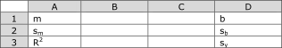

# Colorimetric Determination of Iron Content

## Introduction 

In a [previous experiment](./spectroscopy_workshop) we learned the principles of UV/Vis Spectrophotometry and all about how solutions absorb light. In this experiment we will use UV/Vis spectrophotometry to quantify the amount of light-absorbing species in the sample.

In this experiment, Beer's Law will be used to achieve two goals: (a) to compute (in a manner significantly more reliable than in the previous lab) the molar absorptivity of a light-absorbing species and (b) to determine the concentration of an unknown solution.

### Using calibration curves for interpolation 

Both of the goals of this experiment will be achieved using a calibration curve, also referred to as a standard curve. The process involves the generation and subsequent analysis (spectrophotometric in the case of our experiment) of a series of standard solutions with known concentrations of the desired analyte. By plotting the measured absorbances of the series of solutions against their known concentrations we create a calibration (or standard) curve. Using the method of least squares, the equation of the line best fitting the data (the line of best fit) can be computed.

Software like Excel makes this even easier by allowing us to add a "trendline" to our plots and have the equation displayed on the graph (Figure ). It is important to notice that the line of best fit does not intersect all of the points; rather, it is the line that most closely fits the data. Also notice that we **do not include a point at (0,0) in our data set** -- only data that was recorded in our experiment is included in the plot. As a result, it is likely that the $$y$$-intercept for a Beer's Law plot will not be exactly at the origin. For example, the sample data plotted in Figure leads to a curve that has a $$y$$-intercept that is very close to zero, but the line does not intersect the origin. This indicates that we did a good job experimentally, since we expect the $$y$$-intercept to be zero.

![Absorbance at 625 nm against concentration (in mM) of $${\rm [Co(NH_3)_6^{3+}]}$$ complex ion.  The calibration curve shows a high degree of linearity in the range studied ($$R^2 > 0.9995$$).  The molar extinction coefficient for the $${\rm [Co(NH_3)_6^{3+}]}$$ complex ion is $$1497 \, {\rm L \cdot mol^{-1} cm^{-1}}$$.](imgs/colorimetry_calibrationcurve.svg)

**Figure 1** - Absorbance at 625 nm against concentration (in mM) of $${\rm [Co(NH_3)_6^{3+}]}$$ complex ion.  The calibration curve shows a high degree of linearity in the range studied ($$R^2 > 0.9995$$).  The molar extinction coefficient for the $${\rm [Co(NH_3)_6^{3+}]}$$ complex ion is $$1497 \, {\rm L \cdot mol^{-1} cm^{-1}}$$.

Using the equation of the line of best fit it is now possible to calculate the concentration of an unknown solution from its measured absorbance. Consider the example in Figure : if we record an absorbance (at the appropriate wavelength, 625 nm in this example) of 0.601 for a solution of the same complex, then we can use the equation $$A = 1.4969 c - 0.0036$$ to determine the concentration. In this case, we calculate that the concentration of complex ion in the unknown solution is 0.403 mM or $$4.03 \times 10^{-4} \, {\rm M}$$. Beware: the data plotted in figure has concentrations in mM (not M or g/L). This choice was made so that the range of values on the $$x$$-axis would be moderate in size.

Finally, we can also use the line of best fit to calculate the molar absorptivity of the species in question. Consider what the line of best fit represents: a linear relationship between the absorbance (on the $$y$$-axis) and the concentration of the solution (on the $x$-axis). Furthermore, we know from Beer's Law that the slope of a straight line of $$A$$ versus $$c$$ will be equal to "$$\varepsilon b$$". Therefore, if we know the pathlength, $$b$$, which for most cuvettes (sample cells) is 1 cm, then we can compute $$\varepsilon$$ directly from the slope of the line of best fit. In this case, the molar absorptivity of the complex is $$1497 \, {\rm L\cdot mol^{-1}cm^{-1}}$$. Always report molar absorptivities in these units, regardless of the concentration units that are plotted on the curve.

### Colorimetry and colorimetric reagents 

When the absorption wavelengths involved in a spectrophotometric analysis are in the visible light region of the electromagnetic radiation spectrum (such as in the case of this experiment), this specific analysis is referred to as colorimetry. In this experiment we will accurately determine the iron content of a vitamin tablet using UV/Vis colorimetry.

We will proceed as was described in the previous section and prepare a series of standard solutions of known iron concentration that will be used to prepare a standard curve of absorbance versus concentration. At the same time, a vitamin tablet will be digested (put into solution) to give a solution of unknown iron concentration. That solution will then be treated in the same manner as the standards in order to prepare it for colorimetric analysis. The standard curve can then be used to determine the concentration of the unknown solution from its measured absorbance.

Preparing the vitamin tablet solution involves first digesting the solid tablet in acid while heating. The dissolved iron, now in the form of $${\rm Fe^{3+}} (aq)$$, must then be reduced to by the addition of hydroquinone ([Figure 2](#fig:ophencomplex) top). The alone does not have any particularly strong absorbances in the UV or visible regions. Consequently, we add *o*-phenanthroline, a chelating agent, to produce the strongly colored complex: $$[{\rm Fe(}o{\rm -phen)_3}]^{2+}$$. Here, phenanthroline is called a *colorimetric reagent* for ions: it makes a clear solution into a colored one -- i.e., that absorbs light in the visible region of the spectrum.

**Figure 2** - Reduction of $${\rm Fe^{3+}}$$ to $${\rm Fe^{2+}}$$ by hydroquinone (top) and the complexation of $${\rm Fe^{2+}}$$ by three *o*-phenanthroline ligands to make an octahedral complex ion (bottom).

Phenanthroline is a good choice of colorimetric reagent for iron (II) because it: (a) selectively gives a color to the iron (II) ions, (b) it quantitatively complexes the iron (III), (c) has a relatively intense color (i.e., a large $$\varepsilon$$), and (d) the complexed color is different from the uncomplexed color.

### Preparing and using blanks in spectrophotometric analyses 

Used effectively, Beer's law is a powerful technique for quantifying the concentration of light-absorbing species in solution using spectrophotometry. The absorbance ($$A$$) of light of a given wavelength by a solution varies linearly with the solution concentration ($$c$$) as: 

$$A=\varepsilon bc \tag{1}$$

where $$\varepsilon$$ is the wavelength-dependent molar absorptivity and $$b$$ is the pathlength through which the light travels (e.g., 1.00 cm in a typical UV-Vis instrument). This means that a solution with no light-absorbing-species should have an absorbance of 0, and increasing the concentration of the solution should increase the absorbance proportionally. For instance, doubling the solution concentration will lead to double the absorbance as long as you are working in the range of concentrations in which Beer's law remains true -- for UV-Vis, this region is where the absorbance values will tend to be between 0.1 and 1.0.

One complication that we need to address, however, is that absorbance by our analyte (species of interest) is not the only reason why light might not reach the detector in spectrophotometry. As was discussed in an earlier experiment, the absorbance of the solution is computed as:

$$A=-\log\left(\frac{I_T}{I_0} \right) \tag{2}$$

where $$I_0$$ is the intensity of the light reaching the sample from the light source and $$I_T$$ is the intensity of the light transmitted through the sample. Diffraction and scattering of light by the walls of the cuvette, as well as the presence of interferring species, can lead to less light arriving at the detector than leaves the light source.

Unfortunately, spectrophotometers are not intelligent enough to differentiate between the reasons why light might not be reaching the detector; rather, these instruments merely report the absorbance by taking the negative logarithm of raw current measurements. As a result, we will need a way to digitally correct for the light that is not reaching the detector for reasons other than absorbance by the species of interest. The approach we will employ is to use a *blank solution*.

Blanks are solutions that strongly resemble the samples that we are studying, but with one significant difference: they don't contain any of the light-absorbing species that we are studying. Instead, a blank is prepared by using the same solvents and auxiliary reagents (sample blank). When zeroing the spectrometer, the blank is loaded in the cuvette (the same cuvette you will use for subsequent sampling) and placed in the sample holder. The instrument will save a baseline scan -- which it will use to determine $$I_0$$ -- that takes into account any effects from the cuvette walls, the solvent, and the other species in the cuvette. Consequently, in actual trials that follow, the ratio of transmitted to incident light intensity ($$I_T/I_0$$) will only be a measure of absorbance (primarily).

In some fields, *method blanks* are prepared in the same manner as sample blanks and then they are exposed to the same procedures as the samples we will study (i.e., incubation, heating, etc.). In this way, any changes that may happen to non-analytes in solution as a result of the experimental procedures are also accounted for in the blank solution as well. This is a common practice in many biochemical protocols.

### Linear regression in Excel using LINEST 
In Excel, the command for generating the method of least squares values is **=LINEST(y-values-array, x-values-array,1,1)**. This command will result in a two-by-five (two columns, five rows) or two-by-three table containing an output of slope ($$m$$), standard deviation of slope ($$s_m$$), $$R^2$$, $$y$$-intercept ($$b$$), standard deviation in $$y$$-intercept ($$s_b$$), and the standard deviation in $$y$$ ($$s_y$$).

Start by preparing a table exactly like the one in [figure 3](#fig:excelLINEST) . Next, highlight the ten (or six) cells in between the letters and type the **=LINEST** command as described above. Do not hit enter. LINEST is an *array formula* and you must type ctrl+shift+enter (PC) or control+shift+enter (MAC)[^1] when you finish typing in the command to receive all the desired data. If not, only the first cell will be computed. At this point you now have all of the regression parameters (slope, intercept, $$R^2$$) with associated uncertainties. Using the computed slope and intercept, we can use the calibration curve to determine the $$x$$-value associated with an experimentally-determined $$y$$-value ($$x = (y-b)/m$$).

[^1]: In previous versions of Excel for MAC, the key sequence is command-shift-enter.

**Figure 3** - LINEST table (two-by-three) for linear regression parameters.  Another two rows can also be included.

In reality, we could have computed the slope and intercept in other -- arguably easier -- ways. For instance, the **=SLOPE(y-values-array, x-values-array)** command will return the slope of a line, the **=INTERCEPT(y-values-array, x-values-array)** command will return the slope of a line, and **=RSQ(y-values-array, x-values-array)** will return the coefficient of determination, $$R^2$$. Alternately, these values can be added to a plotted curve using the "trendline" feature.

The reason we use LINEST is two-fold. First, LINEST can be used to quickly and easily compute the parameters of line without graphing. Second, one of the LINEST parameters -- $$s_y$$ -- is necessary for computing the uncertainty associated with a regressed $$x$$ value. The uncertainty in the regressed $$x$$ value ($$s_x$$) is computed using the following equation:

$$s_x=\frac{s_y}{|m|}\sqrt{\frac{1}{k}+\frac{1}{N}+\frac{\left(y-\bar{y}\right)^2}{m^2\sum_i\left(x_i-\bar{x}\right)^2}} \tag{3}$$

where $$k$$ is the number of replicate measurements of the unknown that is being studied using the calibration curve, $$N$$ is the number of observations used in the construction of the calibration curve, $$y$$ is the average measured value for your unknowns, $$\bar{y}$$ is the average $$y$$-coordinate value for the measurements used to construct the calibration curve. While the denominator of the third term in the equation may look imposing, $$\sum_i\left(x_i-\bar{x}\right)^2$$, it is trivially calculated using the **=DEVSQ(x-values-array)** command, where the x-values-array is the array of $$x$$ values of the standard curve values.

### Preparing and using diagrams for subsequent dilutions 

In this experiment we will be preparing a number of subsequent dilutions -- a solution that is diluted several times using different volumes of solution transfered and diluted volumes. At the end, we will determine the concentration of the final solution using spectroscopy, which we will use to learn about the concentration of the initial solution.

The various volumes of pipettes and volumetric flasks can make these calculations tricky to visualize and perform. One of the more powerful approaches to these calculations involves first sketching a diagram for the subsequent dilutions and then working backwards on the dilutions.

Consider the following example: a sample with an unknown number of moles is transfered to a 100 mL volumetric flask and diluted (solution A). A 5 mL sample of solution A is then transfered to a second 100 mL volumetric flask and diluted (solution B). A 25 mL sample of solution B is then transfered to a 500 mL volumetric flask and diluted (solution C). The concentration of solution C is found to be 3 mM. This process is diagramed in [figure 4](#fig:dilutionsfig).

**Figure 4** - Sketch of the dilution of a sample through three subsequent dilutions. This sketch can be used effectively to learn about the original sample using the concentration of the most dilute (Solution C).

To determine the number of moles in the unknown sample, we start by determining the number of moles of solute in solution C:

$$n_{\rm C} = [{\rm C}]\times V_{\rm C} = \left(3 \, \frac{\rm mmol}{\rm L}\right) \left({\rm 0.5\,L}\right) = 1.5\, {\rm mmol} \tag{4}$$

We know that the 1.5 mmol of solute in solution C is the result of having transfered 25 mL of solution B. In other words, the 25 mL sample of B contains 1.5 mmol. We can therefore conclude that the entirety of solution B (before removing the 25 mL sample) must have contained 6 mmol:

$$n_{\rm B} = n_{\rm C}\times\frac{V_{\rm B,total}}{V_{\rm B,transfered}} = \left({\rm 1.5\,mmol}\right) \left(\frac{100 \, {\rm mL}}{25 \, {\rm mL}} \right) = 6\, {\rm mmol} \tag{5}$$

The same process will get us the number of moles of solute in A:

$$n_{\rm A} = \left({\rm 6\,mmol}\right) \left(\frac{100 \, {\rm mL}}{5 \, {\rm mL}} \right) = 120\, {\rm mmol} = 0.120\,{\rm mol} \tag{6}$$

Finally, because solution A is made with all of the unknown sample, we conclude that the sample must have contained 0.120 moles of solute. Note: the significant figures for the dilution calculations are determined by the precision of the glassware. The final answer has three significant figures because a 5-mL pipette has three significant figures (5.00 mL). If we desire to know the concentrations of solutions A and B, we can divide the moles of solute in each by their volumes. That would make the concentrations solutions A and B, 0.06 M and 1.20 M, respectively.

*Notebook tip*: sketching a diagram (like the one in [figure 4](#fig:dilutionsfig)) in your lab notebook is the best way to keep track of the subsequent dilutions that you do in a given experimental procedure. Then, when you are ready to analyze your data, it is much more straightforward to do the calculations. Make sure to prepare a figure like this as you perform your experiment.

## Procedure 

You will work with a partner in this experiment. This experiment involves preparing many solutions and dilutions, which means that it has the potential to be lengthy. Both members of the team should contribute equally and work efficiently in order to finish with sufficient time to check the spectral data. All analysis and post-lab work must be done individually. Make sure to bring a laptop for working up your data in lab and a USB flash drive (some drives are available in lab) for transferring the raw data files from the UV/Vis instrument.

For the pipetting in this lab: use volumetric pipettes when possible. Otherwise, use graduate pipettes. Never use graduated cylinders, volumetric flasks, beakers, etc., for precise delivery of solutions. *Why?* Review the proper use of [volumetric flasks here](labequipment#volumetric-flasks).

### Digesting the vitamin tablet 

- Collect a vitamin tablet and *record its mass* using an analytical balance. Each partner will need their own tablet. Record the manufacturer's estimated weight of the tablet and iron content. *Note:* any time you are analyzing a commercial product, it is important to (a) take precise measurements of the whole product, (b) to record all of the information provided by the manufacturer, and (c) never fully trust the values that these companies report, especially if the purpose of your work is to measure that value and assess their claims.

- Add the tablet to a clean 125 mL Erlenmeyer flask and add 25 mL of 6 M HCl. In a fume hood, boil the solution gently on a hotplate for 15 minutes or until the tablet dissolves completely. If you are sharing a hotplate, make sure to label your flask so as to be able to identify it later. Keep the flask covered with a watch glass to prevent it from boiling dry. There may be a small amount of insoluble binding material left undissolved -- that is ok.

- Make sure to diagram in your notebook how you are working with the unknown. Things will get convoluted and difficult to keep track of in your head.

- After allowing the solution to cool slightly, use a Buchner funnel to filter the solution under vacuum, collecting the insoluble materials on the filter paper. Wash the filter paper with two 5 mL portions of deionized water.

- Collect the filtrate from the previous step and filter it a second time by vacuum (through a new filter paper).

- *If your filtrate (from the second filtration) is clear (i.e., there is no suspended particulate matter) then skip this step.* If your solution is cloudy or contains particulate matter, filter the solution a third time -- this time, filter it through a fluted filter paper in a glass funnel by gravity. If the filter paper gets clogged to the point where the flow through the filter is too slow, replace the filter with a new piece of filter paper. If you need to replace your filter, ask your instructor for direction on how to replace the filter without losing sample.

- Transfer your filtrate to a 100 mL volumetric flask. Wash the beaker with multiple **small** portions of deionized water into the volumetric flask to ensure quantitative transfer of the dissolved iron.

- When completely cool, dilute the solution to the 100-mL mark and mix well. Make sure to follow the instructions in [on this page](labequipment#volumetric-flasks) for proper use of volumetric flasks.

- Using a volumetric pipette, transfer 10.00 mL of the solution from the previous step into a fresh 100 mL volumetric flask. Dilute to the mark with deionized water and mix well. *Why are you diluting this solution again? What would happen if your unknown were too concentrated when you went to record your data?*

- The most dilute solution you prepared in this part is the one that will be used in Part 3.

- If you have not already begun to do so, sketch a subsequent dilution diagram in your notebook for the work that you have already done in this experiment. Label the solutions in the sketches and in the lab to keep from mixing them up. Make sure to update this sketch as you continue to work in the lab, and show your completed sketch(es) to your instructor before the end of the lab.

### Preparing solutions for the calibration curve 

- Obtain 40 mL of the prepared iron stock solution (this solution will have a concentration of approximately $$0.04\,{\rm mg}$$ Fe per mL; record the exact concentration that is provided and use that concentration in your calculations). Pipette 10.00 mL into a beaker and record the pH using pH paper. Add sodium citrate solution dropwise until the pH is about 3.5. Count the number of drops required. Dispose of this solution.

- Pipette a fresh 10.00 mL aliquot of the iron solution into a 100 mL volumetric flask and add the number of drops of sodium citrate solution determined in the previous step. Also add 2.00 mL of hydroquinone solution and 3.00 mL of *o*-phenanthroline solution. Dilute this solution to the 100 mL mark and mix well. Make sure to follow the instructions [on this page](labequipment#volumetric-flasks) for proper use of volumetric flasks.

- As you will have a limited supply of 100 mL volumetric flasks, transfer each solution as it is made to a plastic bottle. Make sure to wash out each bottle with deionized water and then a small amount of your solution to ensure no contamination[^2].

[^2]: When transferring solutions from a volumetric flask to a plastic bottle be sure that you first clean the bottles thoroughly. After they are clean, rather than drying the bottles, simply transfer a small amount of your solution, swirl it around, and discard that solution before adding the remaining solution to the bottle. There is no need to dry the bottles after the rinses.

- Prepare four more solutions from the standard iron solution containing 7.00, 5.00, 2.00, and 1.00 mL of standard. Use sodium citrate solution in proportion to the amount of iron solution used (e.g., if 10 mL requires 30 drops then 5 mL requires 15 drops). Add 2.00 mL of hydroquinone solution and 3.00 mL of *o*-phenanthroline solution to each solution and dilute to the mark. Mix each well. Transfer fully prepared solutions to clean bottles for storage until you are ready to record the UV/Vis data.

- Also prepare a blank solution that contains no iron standard nor sodium citrate. Only include the hydroquinone and *o*-phenanthroline and dilute to the mark with water. *Why is this a good choice for a blank solution?*

### Preparing the digested vitamin solution for spectrophotometry 

- In the same manner as in Part 2, determine how much sodium citrate solution is required to bring 10.00 mL of the unknown iron solution (the most dilute solution from Part 1) to pH 3.5. It will likely require more citrate since it still contains some of the HCl from digesting the tablet! Dispose of this solution.

- Pipette a fresh 10.00 mL aliquot of the unknown solution into a 100 mL volumetric flask, add the required amount of sodium citrate solution from the previous step, 2.00 mL of hydroquinone solution, and 3.00 mL of *o*-phenanthroline solution to the solution. Dilute to the mark and mix well. Make sure to continue adding steps to the diagram that you started in your notebook.

### Recording UV-VIS spectroscopic data 

- Allow the solutions to stand for about 10 minutes.

- If using plastic cuvettes, prepare a separate cuvette for each solution, including a blank. Examine each cuvette to make sure there is nothing obstructing the optical path (e.g. smudges on the outside near the bottom of the cuvette). Gently blot and wipe (do not scrub!) the surface with a methanol-wetted Kimwipe if you need to clean it. Label each cuvette near the top and place them in a cuvette holder, then place the holder in a plastic bin for proper secondary containment for moving to the spectrophotometer room.[^3]

[^3]: If using a quartz cuvette and for better analytical precision, use the same cuvette for all measurements. Use a marker to mark the cuvette on one side to indicate the orientation that your cuvette was inserted into the spectrophotometer. Always use the same cuvette, in the same orientation, for subsequent measurements. Ask your TF for guidance on cleaning the cuvette between solutions and for carefully transferring solutions in the spectrophotometer room.

- Once all of the solutions are ready, you may begin data acquisition. Make sure to follow the provided directions for setting appropriate instrument parameters. Specifically, make sure that the data sampling interval is sufficiently small to get good resolution (definitely less than $$0.5$$ nm) and that the baseline is set through a zero and a blank. [This page](labequipment#cary-60-uv-visible-spectrophotometer) describes the proper use of the UV/Vis spectrophotometers.

- *Notebook tip: note the make/model of the instrument, and the instrument settings, in your lab notebook.* It can be helpful to name the spectra on the computer using the same labels/identifiers that you used in preparing your sketches for the dilutions.

- Record and save the full *visible-light* absorbance spectrum of each of your solutions.[^4] Also record the spectrum of your unknown (diluted tablet) solution.

[^4]: For quartz cuvettes: use the same cuvette that you used to blank the instrument. Start with the least concentrated solution and proceed, in increasing order of concentrations, to the most concentrated solution. Rinse the cuvette with deionized water and the incoming solution between each solution.

- Don't forget to save your spectral data (as a CSV file) and transfer it to your USB storage device before leaving the instrument room. Make a copy of the raw data file and work from the copy; also, you will find it useful to save your copy (the one you will work from) as an Excel Workbook file. **Never edit or work from original data files.**

  Close out of the control software and log off the computer when you're done using the instrument.

- When analyzing your data, use the spectrum of the most concentrated standard to determine the value of $$\lambda_{\rm max}$$ (for this complex, $$\lambda_{\rm max}$$ should be in the area of 510 nm). Make sure to use the same wavelength for each solution analyzed in your Beer's Law analysis.

- You must plot and check your spectral data, on your computer, before you leave the lab.

## Safety and Waste Disposal 

Concentrated (6 M HCl) is an irritant and corrosive. Clean up any spills immediately. Any large (>3-5mL) spills should be neutralized with sodium bicarbonate prior to being cleaned up. If any acid contacts skin, run exposed skin under cold water for several minutes. In any of the above cases, alert the lab instructor immediately. Replace exposed gloves immediately.

All solutions must be disposed of in the large waste container.

## Post-Lab Assignment

### Spectrum and calibration curve

- Using your data for the most concentrated standard, plot the UV-Vis spectrum of the $$[{\rm Fe(}o{\rm -phen)_3}]^{2+}$$ complex.

  **In your post-lab,** include a properly-formatted figure for the spectrum - review the guidelines given in the [Undergraduate's Guide to Writing in the Sciences](https://www.bu.edu/chemed/files/2021/02/UG-Guide-Writing-Sciences-v0.9.pdf#page=17) chapter 2. In the figure, indicate and label the peak absorbance wavelength $$\lambda_{\rm max}$$.

- Calculate the iron concentrations (in $$\mu {\rm M}$$) of the standard solutions. Depending on the exact concentration of the stock solution provided, these concentrations may or may not be the same as the ones you computed in the pre-lab assignment. For each concentration of standard solution, find the absorbance in the corresponding UV-Vis spectrum at the $$\lambda_{\rm max}$$ you determined above.

- In Excel, plot the five calibration curve points then add a trendline with equation and $$R^2$$ to the graph.

  **In your post-lab,** include a properly-formatted figure for the calibration curve. Make sure that you include a meaningful and appropriate caption, which should include the molar absorptivity ($$\varepsilon$$) of the $$[{\rm Fe(}o{\rm -phen)_3}]^{2+}$$ complex at $$\lambda_{\rm max}$$. Make sure to report the value in the appropriate units for molar absorptivity.

- Use the Excel LINEST function to compute the line of best fit parameters for the line fitted through the absorbance data for your standards.

  **In your post-lab,** include a cropped screenshot (only include the relevant part) of the LINEST table from your spreadsheet.

### Iron (III) quantitation

- Using the measured absorbance of your unknown solution (at $$\lambda_{\rm max}$$) and the equation for the line of best fit, calculate the concentration of iron (in $$\mu {\rm M}$$) in your unknown solution. Also calculate the uncertainty in this concentration using the equation for the uncertainty in regressed $$x$$ values $$s_x$$. Be careful to use the correct parameters for $$k$$ and $$N$$.

  **In your post-lab,** include these sample calculations.

- Starting with the concentration (with uncertainty) of iron in your unknown solution from above, undo the dilutions to compute the mass of iron (in mg) in your tablet with uncertainty.

  **In your post-lab,** include these sample calculations.

- Compute the percent relative difference between your experimental value for the amount of iron in a tablet and the amount claimed by the manufacturer. Note: if you get a value that is an order of magnitude different (or more) than the manufacturer's claims, double-check your work and speak with an instructor.

  **In your post-lab,** include this calculation and briefly explain your choice of the expression you used to compute this value (see the [Molecular Size Determination](./molecular_size_monolayer#accuracy-precision-uncertainty-and-error) lab for reference).

- **In your post-lab,** explain whether the value that the manufacturer reports is consistent with your results using an appropriate quantitative comparison against the uncertainty of your measurement. If your value differs from the manufacturer's claim: suggest a reason, based on a close inspection of your data and the research you've done, why your experimental value is different from the value reported by the manufacturer. If it does not differ experimentally, make that assertion.

### Questions for thought

**In your post-lab,** answer the following questions.

- Does the height of the peak on a UV-Vis spectrum have anything do to with the energy of the light transfered to the complex ion? Explain briefly.

- You might have noticed some fluctuations in the location of $$\lambda_{\rm max}$$ from one sample to the next. Why was it important that the absorbances be measured at the same wavelength for each sample?

- The equation $$A=\varepsilon bc$$ directly relates the concentration of a sample, its molar absorptivity ($$\varepsilon$$), and the absorbance of a sample. Instead of bothering with a standard curve, why not make two measurements: first, measure the absorbance of a sample of known concentration in order to compute the molar absorptivity. Second, measure the absorbance of the solution with unknown concentration and use the molar absorptivity from the first to calculate the concentration. Explain why this would, or would not, be a better method than the one we used in this lab.

- Define interpolation and extrapolation. Which is the more reliable/acceptable practice? Why do we avoid extrapolation when we do an experiment with Beer's Law? Why do we avoid extrapolation when we use linear regression? Explain.

- Neither *o*-phenanthroline nor $${\rm Fe^{2+}}$$ are colored in solution. Explain the appearance of color when these two are mixed. (Hint: consider some of the material presented in the [introduction to molecular spectroscopy workshop](./spectroscopy_workshop).)

- This experiment highlights the usefulness of a colorimetric reagent for the analysis of a single component of a fairly complex mixture (the vitamin tablet). What are the important factors to consider when choosing a colorimetric reagent to use for a particular analysis?

## Footnotes