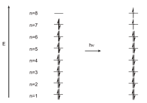

# Modeling Conjugated Dyes with the Multielectron Particle-in-a-Box

## Introduction 

In this experiment you will study the absorption spectra of a related series of dyes by UV/Vis spectrophotometry. The wavelengths of light absorbed will allow us to learn about the electronic structure of these molecules. Consider the structure of the dye 1,1'-diethyl-4,4'-dicarbocyanine iodide [Figure 1](#fig:cyanine):

**Figure 1** - 1,1'-diethyl-4,4'-dicarbocyanine iodide (this is in fact a salt -- so only the cation, and not the iodide anion, is shown).  The conjugated $$\pi$$ system is bolded. Note: while resonance forms are a convenient representation for molecules like this, they are not accurate in describing the electronic structure of the molecule.

As we saw in the [Introduction to Molecular Spectroscopy workshop](./spectroscopy_workshop), absorption of light by molecules leads to a change in their electronic structure. The chromophore (i.e., part of the molecule that absorbs visible light resulting in color) is the system of conjugated double bonds that are bolded in figure -- only the double-bond electrons are involved, not the single-bond electrons.

What is it about this structure that brings about the color? In the valence-bond approach to bonding the double-bonds ($$\pi$$-bonds) are depicted as bonding pairs that can adopt one of two equivalent resonance forms (depicted by the double-ended arrow, $$\leftrightarrow$$, in [Figure 1](#fig:cyanine)), depending upon which pairs of atoms we choose to connect with the $$\pi$$-bonds. While the valence-bond approach to bonding does a good job of respresenting the connectivity ($$\sigma$$ structure) of these molecules, it does not correctly represent the $$\pi$$-bonding structure of the molecules. In other words, it is simply **not** reality.

### Introduction to molecular orbital theory of bonding 

The failure of the valence bond approach can be most easily seen in molecules like 1,3,5-hexatriene ([figure 2](#fig:orbitalshex)), where there are no resonance forms for the molecule. Consequently, someone may erroneously believe that the $$\pi$$ electrons in hexatriene are localized -- i.e., in the three fixed locations depicted in figure (a). This would imply that while three of the carbon-carbon bonds are not able to rotate (because they are double-bonds), the other two carbon-carbon bonds (that are only single-bonds) are able to rotate. In reality, however, none of these bonds rotate because the $$\pi$$ electrons are actually delocalized across the length of the entire molecule.

**Figure 2** - Four representations of the 1,3,5-hexatriene molecule: (a) Lewis structure showing three, localized $$\pi$$ bonds; (b) skeleton structure showing the six unhybridized p orbitals; (c) side-view showing the lowest-energy $$\pi$$ molecular orbital ($$n = 1$$); and (d) top-view of the lowest-energy $$\pi$$ molecular orbital ($$n = 1$$).

In order to explain the actual electronic structure of the $$\pi$$ system of 1,3,5-hexatriene we will need to use another approach -- molecular orbital (MO) theory. In MO theory, the $$\pi$$ system is constructed from the overlap of the unhybridized p orbitals on each of the carbon atoms. In hexatriene, each of the carbon atoms is $${\rm sp^2}$$ hybridized, which means that there is one unhybridized p orbital on each carbon atom ([figure 2(b)](#fig:orbitalshex)). These unhybridized p-orbitals, on the individual atoms, form molecular orbitals that are delocalized along the entire length of the conjugated system. As a result, the molecule's $$\pi$$ electrons are not actually stationary in double-bonds; rather, the $$\pi$$ electrons exist as a wave, or cloud, that is delocalized over the entire molecule.

The lowest-energy $$\pi$$ MO ($$n = 1$$) for hexatriene is depicted in ([figure 2(c and d)](#fig:orbitalshex)). The six unhybridized p orbitals will form six molecular orbitals (one MO for each atomic orbital). The three lower-energy MOs are bonding molecular orbitals (which is consistent with the three double bonds that the valence-bond approach predicts), and the three higher energy MOs will be antibonding molecular orbitals. The difference in energy between the highest occupied molecular orbital (HOMO) and the lowest unoccupied molecular orbital (LUMO) is quite small. The energy of the light required to promote an electron between these states is equal to the energy difference between the HOMO and the LUMO, and falls in the visible range of the electromagnetic spectrum, giving rise to the distinctive dye color we observe for these conjugated dye molecules. Visual representations of some of the $$\pi$$ MOs for hexatriene are shown in [figure 3](#fig:MOs).

**Figure 3** - Four lowest-energy $$\pi$$ molecular orbitals of 1,3,5-hexatriene.  The lowest-energy molecular orbital ($$n = 1$$) has one "loop" -- i.e., one half-wavelength.  As the number of half-wavelengths (loops) increases, so does the energy of the MO.  In hexatriene, the $$n = 3$$ orbital is the highest occupied molecular orbital (HOMO) and the $$n = 4$$ orbital is the lowest unoccupied molecular orbital (LUMO).

A note about excitation of electron clouds: the process of light being absorbed by a molecule results in a change in shape of the electron cloud. As we've discussed, electrons in atoms and molecules behave as waves (wavefunctions) with distinct energy, shape, and orientation. Light causes the ground-state electron cloud to become transformed into a new electron cloud described by a different wavefunction. In hexatriene, the lowest energy absorption causes the $$n = 3$$ electron cloud to be transformed into the $$n = 4$$ electron cloud.

### Modeling conjugated systems with the particle-in-a-box model 

To model the $$\pi$$ molecular orbitals for our dyes we will use the simplest quantum mechanical model for a one-dimensional system: the 1D "particle-in-a-box" model. In this model, the molecular orbitals -- the electron cloud -- are modeled as a quantum object confined to a 1-dimensional box of length $$L$$ by inifinitely large potential barriers at the edges of the box. For our purposes, we will start by assuming that $$L$$ is the length of the conjugated $$\pi$$-system, meaning the total distance from nitrogen to nitrogen. We will also assume that the potential energy of the electrons is zero along the length of the $$\pi$$-system (this is one of the assumptions necessary for a 1D particile in a box model) and infinity outside of the $$\pi$$-system (i.e., that the barriers at the edges are inifinitely high). The particle-in-a-box model can be used to describe the electron cloud as a standing wave that is confined to a region of 1D space by "walls" with infinite potential energy ($$V_0 = V_L = \infty$$). The particle-in-a-box model predicts that the allowed energies are given by

$$E_n = \frac{n^2h^2}{8m_eL^2} \tag{1}$$

where $$n$$ is the number of loops (half-wavelengths) of the wave ($$n-1$$ nodes) ranging from 1 to infinity, $$h$$ is Planck's constant, and $$m_e$$ is the mass of the electron.

Returning to our discussion of the cyanine dyes, this general form ([equation 1](#eq:e1)) of the particle-in-a-box model can be used to model our systems. The number of electrons ($$N$$) in the $$\pi$$-system is found by considering the number $$\pi$$ (double) bonds and delocalized lone pairs. For the dye illustrated in [figure 1](#fig:cyanine), six double bonds (12 electrons) and one lone pair (2 electrons) are involved for a total of 14 electrons in the $$\pi$$-system. Notice that only the double bonds involved in the delocalized, conjugated system (highlighted in the figure) are included. The remainder of the double-bond electrons, and all of the single-bond electrons, will not be part of our system.

We can now determine the nature and energy of the electronic transition corresponding to the absorption of light by the dye molecule. Knowing that there are a total of 14 electrons in the $$\pi$$-system, we can determine the ground state electron configuration for the electrons of the $$\pi$$-system using the allowed energies predicted by the particle-in-a-box model and the rules that we developed for building electron configurations for multi-electron atoms -- the *Aufbau* Principle, Pauli Principle, and Hund's Rule. Since each orbital can describe a maximum of two electrons, the ground state electron configuration ($$S_0$$) is

$$S_0 \equiv n_1^2 n_2^2 n_3^2 n_4^2 n_5^2 n_6^2 n_7^2 n_8^0 \tag{2}$$

where $$n_i^j$$ is the $$i^{th}$$ energy level that contains $$j$$ electrons (0, 1, or 2). In the case of our 14-electron system, the first seven levels are occupied (14/2 = 7) and the lowest unoccupied state is the 8th level ([Figure 4](#fig:photoexcitelevels), left side).

It follows that the first excited-state electron configuration ($$S_1$$) that will result from the excitation ([Figure 4](#fig:photoexcitelevels), right side) is

$$S_1 \equiv n_1^2 n_2^2 n_3^2 n_4^2 n_5^2 n_6^2 n_7^1 n_8^1 \tag{3}$$

Notice that the seventh energy level (formerly the HOMO) is now only part-filled and there is an electron in the eighth energy level (formerly the LUMO).

**Figure 4** - Energy levels before (left) and after (right) photo-excitation

If we let $$n_f$$ represent the level of the electron in the final state (and $$E_f$$ the energy of that state), and $$n_i$$ represent the level of the electron in the initial state ($$E_i$$ the energy of the initial state), the energy of the transition can be represented as

$$\Delta E = E_f - E_i = \frac{h^2}{8m_eL^2}\left(n_f^2 - n_i^2\right) \tag{4}$$

where $$\Delta E$$ is the energy gap between the HOMO and the LUMO. For an even number of electrons in the conjugated system, $$n_f = N/2 + 1$$ and $$n_i = N/2$$ (recall, $$N$$ is the number of electrons in the conjugated system). Substituting these values into [equation 4](#eq:e2) yields:

$$\Delta E = \frac{h^2}{8m_eL^2}\left(N + 1\right) \tag{5}$$

The energy change of the electron cloud ([equation](#eq:e3)) is exactly the energy of the photon of light that is absorbed. As a result, combining [equation 5](#eq:e3) with $$E_{\rm photon} = hc/\lambda$$ provides us with an expression for the wavelength of light required to stimulate this excitation:

$$\lambda = \frac{8m_ecL^2}{h(N +1)} \tag{6}$$

The goal of modeling is to be able to make predictions about a system based on concept and empirical measurements. In order to predict the absorption wavelength, $$\lambda$$, given the structure of the dye, all that remains unknown is to model the length of the "box", $$L$$ (i.e., the length of the electron cloud). We will start by assuming that the length of the box is simply the bonded distance between the nitrogen atoms that border the conjugated system. We will test this assumption in the lab and, if necessary, refine our model.

The simplest approach would be to assume that all of the bonds are linear, which would mean that that length ($$L$$) is computed by multiplying the number of single bonds ($$b$$) between the two nitrogen atoms by some average bond length ($$l_B$$), yielding [equation 7](#eq:e5). Substituting into [equation 6](#eq:e4) we can predice excitation wavelengths, $$\lambda$$, using our model:

$$\lambda = \frac{8m_ec\left(b \cdot l_B \right)^2}{h(N + 1)} \tag{7}$$

Let's return to the example of 1,1'-diethyl-4,4'-dicarbocyanine iodide ([figure 1](#fig:cyanine)) that we started earlier. Notice that the two nitrogens in this molecule are separated by twelve single bonds (excluding any double-bonds), which means that $$b = 12$$. All that remains is to use a reasonable guess for the average bond length and we will be able to make a prediction about the maximum absorbance wavelength. For our purposes, we will use the carbon-carbon (C--C) bond distance in benzene as a first guess for the average bond length in our conjugated dyes. This choice is a good one because benzene is very similar to the molecules that we are studying: benzene can also be described by two resonance structures, and so the C--C distance is intermediate between a single and double bond, as is the case here. In benzene the average length of a C--C bond is 1.40 Å (1 Å = $$1 \times 10^{-10} \, {\rm m}$$).

### Empirical modeling in chemistry 

Empirical modeling refers to the activity of creating models for the physical world using the results of experiment. The general process involves observing and studying a relationship between the behavior of the model and that of its referent (the thing being modeled). The term "empirical" means that the modeling process will likely involve one or more of the following characteristics: it may involve a lot of trial-and-error, it may be based on numerical modeling and formulas, and/or it may lead to a model that gets a "correct" answer without actually affording good reason for why it should be correct.

In chemistry, we use this type of modeling in order to try to make a particular part or feature of the chemical world easier to understand, define, quantify, visualize, or simulate by referencing it to analogous concepts or other ideas that are known. In the case of this experiment, we will try to model conjugated $$\pi$$ systems using a relatively straightforward model: the one-dimensional particle in a box.

In this experiment we will be studying the six dyes depicted in Figure . These form two sets of structurally-related dyes -- those in the first column (left) form one series (the 2,2' series) and those in the second column (right) make up the second series (the 4,4' series). These numbers refer to the position of the bridging carbons on the 6-membered ring relative to the nitrogen atoms. The main goal of the experiment is to get a sense for the process of empirical modeling: proposing a model, testing our initial model by evaluating the success of the equation we derived for predicting the wavelength of light that will cause exciting from the HUMO to LUMO of these conjugated systems ([equation 7](#eq:e5)), and making refinements to our model (and repeating).

Understandably, rarely will models be completely successful at describing the systems that they are modeling or at reproducing observables. Often, models will be better suited for studying some systems and not others. Moreoever, it is *usually necessary* to make improvements and changes to our models as we make more measurements. This will be the case in this experiment: we will start by using the model as we have proposed it in this introductory section, but we will then propose modifications based on initial laboratory measurements. These modifications will then subsequently be tested as well. In many instances, a "successful" model will be one that gives a good understanding of what is going on, even if its predictions are not quantitatively accurate.

### Linear regression in Excel using LINEST 

Empirical modelling often requires attempting to fit a mathematical function to a set of data. One of the fundamental tools for fitting a function to data (sometimes called curve-fitting) is the method of least squares for a best fit line or linear regression.

In Excel, the command for generating the method of least squares values is **=LINEST(y-values-array, x-values-array,1,1)**. This command will result in a two-by-five (two columns, five rows) or two-by-three table containing an output of slope ($$m$$), standard deviation of slope ($$s_m$$), $$R^2$$, $$y$$-intercept ($$b$$), standard deviation in $$y$$-intercept ($$s_b$$), and the standard deviation in $$y$$ ($$s_y$$).

Start by preparing a table exactly like the one in [figure 5](#fig:excelLINEST) . Next, highlight the ten (or six) cells in between the letters and type the **=LINEST** command as described above. Do not hit enter. LINEST is an *array formula* and you must type ctrl+shift+enter (PC) or control+shift+enter (MAC)[^1] when you finish typing in the command to receive all the desired data. If not, only the first cell will be computed. At this point you now have all of the regression parameters (slope, intercept, $$R^2$$) with associated uncertainties. Using the computed slope and intercept, we can use the calibration curve to determine the $$x$$-value associated with an experimentally-determined $$y$$-value ($$x = (y-b)/m$$).

[^1]: In previous versions of Excel for MAC, the key sequence is command-shift-enter.

**Figure 5** - LINEST table (two-by-three) for linear regression parameters.  Another two rows can also be included.

## Procedure 

*Make sure to bring a laptop computer and a flash drive for this lab. If you don't have a flash drive may be able to borrow one from your lab instructor.*

You may use your lab manual in lab this week to refer to the dye structures and the equations, but you will still use your lab notebooks in this lab.\
Prepare your lab notebook ahead of arriving at the lab, and keep in mind the following important guidelines:

- Make tables in your notebooks for instrument make and model and the parameters that you will set during the lab. Also make tables to collect information about each dye (concentration, color, etc.).

- Due to the expense of the dyes, pre-made solutions of the dyes of an appropriate concentration in methanol will be provided for you. You should make a note of the concentration of each dye solution.

- Working in the groups assigned by your lab instructor, collect UV/Vis spectra of the 2,2' dyes (only). Prepare all three 2,2' dyes in plastic cuvettes and cover the top of each with parafilm to prevent evaporation. Place them in a cuvette rack and place the rack in a plastic bin to carry the samples from room to room in a building. Note: the bin is called secondary containment and is necessary whenever carrying chemicals between rooms.

- Consider the following important details about your data collection:

  - Follow the instructions you are provided carefully and quickly. You should not need more than 10-15 minutes (max) to collect the spectra for the 2,2' dyes;

  - Only record the visible region of the spectrum (380-900 nm);

  - Make sure to set a reasonable data collection interval (less than 0.5 nm), and follow carefully all of the instructions that you are provided;

  - Have your instructor double-check that your cuvette is in the correct orientation before you start;

  - There is no need to input the full names of the compounds when you are collecting the data -- rather, you should use a code (e.g., 22cy for the 1,1'-diethyl-2,2'-cyanine iodide). Make sure to note what each code refers to in your lab notebook;

  - Save the spectra as a CSV (comma-separated values) file and transfer via flash drive to your laptop; and

  - When working with major instrumentation (such as UV/Vis), always keep a record in your research notebook of the make and model of the instrument and the parameters that you used.

- Return to the lab and start preparing a figure for the 2,2' set of dyes. Your instructor will let you know when you can record the spectra of the remaining three 4,4' dyes.

- Before you start working on your figure, make a copy of the raw data file and work from the copy. **Never edit or work from original data files in any lab.** Also, you will need to save your copy (the one you will work from) as an Excel Workbook file so that your figures and calculations will be saved.

- Complete the data analysis portions of the post-lab assignment before leaving the lab. Use all remaining time to work on the Questions for Thought.

## Safety and Waste Disposal 

The dyes used in this lab are toxic. Handle only with gloved hands and with care. Methanol is an organic solvent that is highly flammable and poisonous. Change your gloves immediately if they are exposed to the dye solutions, and never touch a computer with gloved hands.

## References 

This lab is derived from experiments designed by Drs. Harris and Ziegler at BU.

Kuhn, H. *J. Chem. Phys.* **1949**, *17*, 1198-1212.

## Post-Lab Assignment 

Updated post-lab assignment to come!

<!--
1.  \
    You may find it useful to review concepts from lab #4. Consider the spectrum in Figure :

    1.  There are two peaks in the spectrum (at 650 nm and 700 nm), which correspond to two different changes in the molecule. Calculate the energy of the light being absorbed that corresponds to the *smallest energy change in the molecule* (in kJ/mol).

    2.  The visible range of the spectrum is 380-800 nm, while the instruments that we used record the UV and visible light regions (180-900). Why don't we plot the UV region of spectra that are recorded in plastic cuvettes? If we wanted to see this region, what would we have to do?

    3.  How would the you expect the spectrum to change if it was recorded using a $0.50$ cm cuvette instead of a $1.00$ cm cuvette? Explain briefly.

2.  \
    We will start by calculating the predicted absoprtion wavelengths for each of the dyes using the model described in the introduction to this experiment. Use Excel to tabulate the values and streamline your calculations.

    1.  Start by determining the number of electrons in the conjugated $\pi$ system for each dye. Note: this includes the delocalized lone pair, but does not include all of the double bonds in the entire molecule (only the highlighted conjugated system).

    2.  You will also need to estimate the length of each molecule's conjugated system by determining the number of single bonds between the nitrogen atoms. Make sure that you compute the length in meters, not Angstroms.

    3.  Calculate the predicted absorption wavelength (in nm) using the equation for the excitation wavelength.

    For this question, include a single properly-formatted table containing the pertinent values and the predicted wavelengths, and one sample calculation for the wavelength for one of the molecules (including all of the important values). Make sure to review appropriate table formatting in the [Undergraduate's Guide to Writing in the Sciences](https://www.bu.edu/chemed/files/2021/02/UG-Guide-Writing-Sciences-v0.9.pdf#page=17) chapter 2.\

3.  1.  Using Excel, plot the spectra (380-900 nm). Use smoothed lines with no data point markers. *This choice is different than how we usually graph our data for things like calibration curves. Explain very briefly why this is appropriate here.* Plot all of the 2,2' dyes on the same graph and all of the 4,4' dyes on a second graph. Make sure to include appropriate captions for each figure that you produce. Make sure to review appropriate figure formatting in the [Undergraduate's Guide to Writing in the Sciences](https://www.bu.edu/chemed/files/2021/02/UG-Guide-Writing-Sciences-v0.9.pdf#page=17) chapter 2.

    2.  Determine the wavelength and absorbance at the maximum absorbance wavelength ($\lambda_{\rm max}$) for each dye. Tabulate your data.

    3.  How well do your predictions in question 2 agree with the measured wavelengths? Explain. Make sure to include a sample calculation for your percent difference calculations, and include these values in the table you produced in 3(b).

    4.  Using the absorbances and the concentrations of the dyes, calculate the molar absorptivity (in ${\rm M}^{-1}\mathrm{cm^{-1}}$) of the dyes at $\lambda_{\rm max}$. Show your work for one calculation. Add these values to the table you made in 3(b). Note: in general, it is preferable to minimize the number of tables includes and maximize the utility of any given table by including any relevant data; it is conceivable that multiple sections of a paper or report could reference the same table.

4.  As you saw in question 3(c), our model has not done a particularly good job of predicting our dyes' excitaiton wavelengths. Let's propose a set of modifications to our model.

    It is not realistic to expect the edge of the box to be the nitrogen atoms -- in other words, the nitrogens do not behave as inifinitely potential barriers. We know that the electrons are delocalized onto these atoms, but according to how we discussed using the model, the energy of the electrons here would be infinite.

    In a modification of our initial model, the box could be allowed to extend one bond beyond each nitrogen atom so that the nitrogen atoms remain inside the box while keeping the number of electrons the same. This could help improve the ability of our model to make predicitons based on how we believe the electrons are actually behaving.

    In this proposed modification to how we use our model, the equation for excitation wavelength prediciton remains the same. The only difference is that the number of bonds ($b$) will be 2 greater than the number of bonds used previously (and the number of electrons will not have changed).

    1.  Calculate the wavelengths expected for each dye using our refined model, and present the data in a table (should this be a new table, or should you include it in the table that you've already started constructing?). Show work.

    2.  Compare the wavelengths predicted by this refined model to your experimentally-determined wavelengths. Which does a better job: the initial model or our refined model? Explain.

5.  Another way to approach modeling is to use experimental data to try to fit our model. Let's see how this approach can be used to calculate the length of the conjugated system and estimate bond lengths.

    Instead of making assumptions about the box length, $L$, the spectroscopic data can be used to calculate the box length. Also, the experimentally determined box lengths, $L$, can then be used to compute the bond lengths, $l_B$. To calculate a value for the C--C bond distance (i.e., the average bond length $l_B$), the following equation is used:

    $$\begin{equation}
        L = b\cdot l_B + \gamma
        \label{9}
    \end{equation}$$

    where $L$ is the box length computed in from the spectroscopy data, $b$ is the number of bonds, and $\gamma$ is an empirical correction factor. By plotting the calculated $L$ values versus $b$, the slope of the line of best fit will be the bond length $l_B$ and the $y$-intercept will be $\gamma$.

    1.  Rearrange equation ([\[e4\]](#e4){reference-type="ref" reference="e4"}) to be suitable for calculating $L$ for a given wavelength. Using your experimentally determined wavelengths, calculate $L$ for each of the dyes. Tabulate your results in a table.

    2.  Using the data for $L$ from (a) and using both series of dyes (the 4,4' and 2,2' series): generate plots (2 graphs total), and calculate the bond length $l_B$ and correction factor ($\gamma$) using LINEST. Include a cropped screenshot (only include the relevant part) of the LINEST table from your spreadsheet in your assignment.

    3.  What flaws are there in using this approach to calculate the bond length? Explain.

    4.  Is this still a particle in a box model, or have we used a different model here? Explain.

6.  1.  Based on our experimental results, what conclusions (claims) can we make about the particle-in-a-box model's ability to predict the excitation wavelengths of dye molecules like the ones we've studied? Explain.

    2.  The premise of this model is based on a set of assumptions. What, if any, flaws are there in applying these assumptions to molecules like the ones we are studying? How did this affect our ability to use the particle-in-a-box model to make predictions for these molecules?

    3.  Propose a possible modification to improve and build on our model. Be specific and detailed in your description. Explain briefly the reasons for your proposed modification(s).

-->

> **Submitting your post-lab assignment using Gradescope**
>
> If you are submitting your post-lab assignment online through Gradescope, please keep the following in mind:
>
> 1. You need to submit your assignment in PDF form. Uploading other types of files will lead to major formatting changes and may not be accepted by Gradescope.
>
> 2. Refresh Gradescope after uploading to make sure that your assignment has been successfully submitted - you should be able to view your uploaded assignment on Gradescope. *It is your responsibility to make sure that your assignment is received.*

## Footnotes