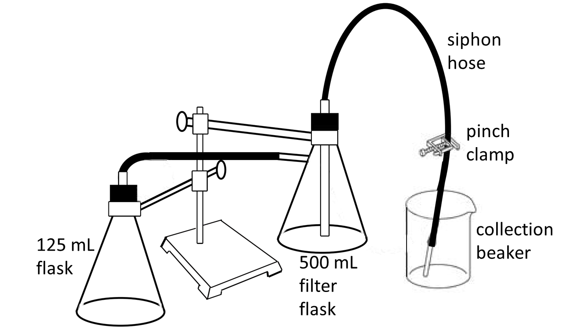

# Stoichiometry of the Reaction of Magnesium with Strong Acid

* TOC
{:toc}

## Introduction 

Along with color change and precipitate formation and dissolving, gas evolution is one of the most common indicators of chemical reaction. In this experiment we will investigate the reaction of a metal with a strong acid, such as HCl. In these reactions, when the standard reduction potential of the metal is less than zero, the products of this reaction are a cation of the metal and hydrogen gas:

$${\rm M} (s) + x {\rm H_3O^+} \, (aq) \rightarrow {\rm M}^{x+} (aq) + \frac{x}{2} {\rm H_2} (g) + x {H_2O} (l) \tag{1}$$

where $$x$$ is the *stoichiometric factor* and is the appropriate number of moles of acid that will digest a mole of the specific metal in question. In this experiment we will compare two quantitative methods for determining the stoichiometric factor ($$x$$) for the reaction of magnesium and excess HCl. The first method involves measuring the volume of generated by the reaction. The second method involves determining precisely how much HCl is consumed by the magnesium.

### Gas laws 

In order to measure the number of moles of generated, and hence the number of moles of HCl consumed, we will use the Ideal Gas Law:

$$PV = nRT \tag{2}$$

where $$P$$ is the pressure of the gas (in atm), $$V$$ is the volume of the gas (in L), $$R$$ is the molar gas constant ($$0.08206 \, {\rm L \cdot atm \cdot mol^{-1} \cdot K^{-1}}$$), $$T$$ is temperature of the gas (in K), and $$n$$ is the number of moles of the gas. It is clear that in order to compute the moles of gas released, we will first need to know the pressure, temperature, and volume of the gas.

The temperature is the easiest of these values to determine. As long as the apparatus used is allowed to return to room temperature after the reaction, the temperature of the gas is simply the ambient temperature in the lab or the temperature of the water that is collected.

The pressure is a little trickier to calculate. Following the procedure carefully (regarding the heights of the water levels) will allow us to ensure that the pressure of the gas in the apparatus is the same as the barometric pressure in the lab. The only complication is that the gas generated from the reaction will actually be a mixture of hydrogen gas $${\rm H_2} (g)$$ and water vapor $${\rm H_2 O} (g)$$. Since these gases will behave as Ideal gases, Dalton's Law of Partial Pressures can be used to determine the pressure of the hydrogen gas that is produced.

The pressure of the gas is related to the barometric pressure in the lab via Dalton's Law according to:

$$P_{\rm bar} = P_{\rm H_{2}} + P_{\rm water} \tag{3}$$

where $$P_{\rm bar}$$ is the barometric pressure in the lab, $$P_{\rm water}$$ is the water vapor pressure at the ambient temperature of the lab, and $$P_{\rm H_{2}}$$ is the pressure of the gas generated.

The final quantity required, the volume of the gas evolved, will be calculated from the mass of water displaced from the siphon by the reaction and the density of the water at that temperature. Using all of this information, the number of moles of $${\rm H_2}$$ generated is computed using the Ideal Gas Law. Finally, from the number of moles of $${\rm H_2}$$ generated, the stoichiometric factor is then computed.

### Grubbs test 

Another important objective of this experiment is to become familiar with additional statistical interpretation of data. Building on our repertoire of mean, standard deviation, and RSD, we introduce the Grubbs test for treating outlying data in a set, Students' $$t$$-statistic, and confidence intervals.

Having been already exposed to the concepts of mean, standard deviation, and relative standard deviation, we will now explore other (more sophisticated) forms of statistical analysis. We'll start by discussing potential outlying data points. It happens to almost everyone: you record several data points that are very close to each other, but there is one data point that seems very different. If we could ignore that outlying data point our averages and deviations would look much better. The question is: can we ignore it? No, recorded data is not something that can simply be discarded in order to make our numbers look better. If we know for a fact that we made a procedural error, then that is a different story; legitimately recorded data, however, cannot be discarded without statistical treatment: the Grubbs test.

The Grubbs test compares the most outlying data point in a set with the average and standard deviation of a set of data. As data are recorded, it is expected that the vast majority of points will be closely spread around the mean value. Of course, it is always possible that a far-outlying point is recorded, but that is unlikely when the number of data points is small. The premise behind the Grubbs test is that by looking at the number of standard deviations between the potential outlier data point and the mean value, we can assess the likelihood that a far-outlier has been erroneously recorded with only a few measurements. Comparing the calculated Grubbs statistic to a critical value tells us whether the point is validated and must be retained, or if we must discard the point as being statistically irrelevant.

The test is performed by computing the Grubbs statistic, $$G_{\rm calc}$$, which is defined as:

$$G_{\rm calc} = \frac{\vert x^{\prime}-\bar{x} \vert}{s} \tag{4}$$

where $$s$$ is the standard deviation of the data set, $$x^{\prime}$$ is the most outlying data point, and $$\bar{x}$$ is the mean of the data set.

If the calculated Grubbs statistic, $$G_{\rm calc}$$, is smaller than the critical value of the Grubbs statistic ([see the table linked here](tables#statstGQ)), $$G_{\rm table}$$, then the point must be retained. If, however, $$G_{\rm calc}$$ is greater than $$G_{\rm table}$$, then the point is discarded and the mean and standard deviations are recomputed.

---

*Example -- Grubbs test*

Consider the data set:

$$5.55, \mathbf{5.01},  5.54,  5.49,  5.50,  5.52,  5.48\;\;\;\;\;\;\; (\bar{x} = 5.441, s=0.192)$$

The bold point is the most outlying point and, therefore, the first that is considered for possible elimination.

The Grubb statistic is therefore:

$$G_{\rm calc} = \frac{\vert 5.01-5.44 \vert}{0.19} = 2.25$$

For seven data points, $$G_{\rm table} = 1.938$$.  Since $$G_{\rm calc} > G_{\rm table}$$, therefore the point $$5.01$$ is discarded and the statistics must be recomputed.  Since a point has been discarded, this procedure should be repeated using the next most-outlying point.

---

### Confidence interval (type A) 

For a data set containing a limited number of measurements, it is impossible to find the true mean, $$\mu$$, or the true standard deviation, $$\sigma$$. Instead, we compute the sample mean and sample standard deviation, $$\bar{x}$$ and $$s$$. To unite the two (true mean/deviation and sample mean/deviation) we use the confidence interval, $$\Delta$$. The confidence interval represents the range about the sample mean within which there is a specified probability of finding the true mean. We say that the true mean, $$\mu$$, is most likely to lie within a certain range of the sample mean, $$\bar{x}$$. This range is given as:

$$\mu = \bar{x} \pm \Delta = \bar{x} \pm \frac{ts}{\sqrt{N}} \tag{5}$$

where $$s$$ is the sample standard deviation, $N$ is the number of observations, and $$t$$ is Student's $$t$$ and is taken from Table [\[tab:QGt\]](#tab:QGt){reference-type="ref" reference="tab:QGt"}. For historical reasons, which have now become the accepted convention in statistics, we will use the 95% confidence limit (i.e., $$\alpha = 0.05$$) values for $$t$$.

In some larger data sets, the statistics in the table will not be sufficient. In those cases, Excel is capable of computing the t-statistic using the formula: **T.INV.2T(alpha, df)** where `alpha` is 0.05 for the 95% confidence limit and `df` is the number of degrees of freedom ($$N-1$$).

---

*Example -- Confidence interval*

Returning to the data in the previous example: after the point 5.01 was discarded, the new set statistics are:

$$\bar{x} = 5.51_3 \;\;\; s= 0.02_8$$

At the 95% confidence limit, the student's $$t$$ value for 5 degrees of freedom (# of data points - 1) is $$t^{(95\%)}_5= 2.571$$. The 95% confidence interval around the sample data is given as:

$$\begin{split}
\Delta &= \pm \frac{2.571\cdot 0.02_8}{\sqrt{6}} = 0.02_9 \\
& \\
\mu &= 5.51_3 \pm 0.02_9 
\end{split}$$

We would report the confidence interval with the mean as $$5.51_3\pm 0.02_9$$ (presumably with a unit) -- always report confidence intervals in this way.

---

Notice in the example (above): since the confidence interval is non-zero in the second decimal place, this means that the second decimal place is the last figure in which we are confident. As a result, the mean is only reported to two decimal places (this is the *real* significant figure rule). Additionally, the first non-significant figure is reported as a subscript. This is common practice **for statistics values** only (averages, standard deviations, and confidence intervals) -- do not report extra figures for any other values.

Until now we have compared our experimental results to literature, or known, values using the concept of percent relative difference, or simply with a qualitative statement regarding the similarities. Now we can also use the confidence interval to ascertain whether or not an experimentally determined data set is statistically consistent with a known value, $$\mu_0$$, or another experimental value. If the value falls inside our confidence interval then we say that they are statistically consistent at the 95% confidence limit. Alternately, in the language of statistics, we say that $$p < 0.05$$, which means that the likelihood of this being a false positive result is less than 5%.

## Procedure 

You will work in pairs for this experiment. While the experiment is straightforward, you will have to perform five (5) trials. Consequently, you will need to work efficiently in order to finish all of the experiment in the time allotted and complete the analysis.

### Assembling the apparatus and siphon 

Carefully assemble the apparatus ([Figure 1](#fig:gasmonometer)) consisting of a 125 mL Erlenmeyer flask, a 500 mL filter flask, a 150 mL beaker, and various glass tubing and rubber hoses. Remove the stopper from the filter flask and fill it 3/4 way full with deionized water. Add 25 mL of deionized water to the beaker. Detach the stopper assembly from the filter flask, invert it, and proceed to fill the entire assembly with water. Use a squirt bottle to help force the water through the whole siphon or attach a hose to the side-arm of a water faucet and to the end of the siphon to draw water into the siphon until it's full. Once the siphon is filled with water, and you've removed most or all of the air bubbles, firmly re-attach the pinch clamp to the tubing to hold the water in place. Insert the siphon ends into the filter flask and beaker.

Remove the pinch clamp, then raise and lower the beaker so that water flows back and forth from the filter flask and all remaining air bubbles are removed. Once the siphon is intact and you are convinced that the system is airtight, tightly attach the pinch clamp to the siphon. This will prevent any flow of water prematurely. When you are ready to start the reaction, replace the collection beaker with a dry and weighed 150 mL beaker.

**Figure 1** - Apparatus for measuring the volume of gas evolved in a reaction.

### Reaction of Mg *(s)* with HCl 

- Obtain a clean and dry vial and record the weight of the vial on an analytical balance. Do not handle the vials with bare hands. Carefully add between 90 and 100 mg of magnesium turnings ($$d_{\rm Mg} = 1.738 \, {\rm g/mL}$$) and re-weigh in the vial (add or remove magnesium until you have 90-100 mg).

  If having trouble with getting the vial to tip over in the step where you start the reaction, try replacing the vial with a square plastic cuvette.

- Transfer 25.00 mL of 1.0 M HCl to the 125 mL Erlenmeyer flask using a volumetric pipette. Do not get any acid on the sides of the flask.

- Carefully insert the vial of magnesium into the 125 mL Erlenmeyer flask. Do not let it tip over until you are ready to begin the reaction.

- This step requires some speed and agility: release the clamp that is securing the 125mL Erlenmeyer flask and begin to agitate so that the vial with the magnesium tips over and the reaction begins. As soon as the first small bubbles appear (i.e., the reaction begins), release the pinch clamp on the tubing so that the water can flow into the empty collection beaker. If this is not done with enough speed, the pressure build-up will cause the seals to break. If this is done too early, the siphon will take up air and need to be remade.

- Take the collection beaker and raise it until the water levels in the beaker and the filter flask are approximately the same. Hold the beaker at this level and adjust its height as necessary to keep the water levels even. Continue to agitate and swirl the reaction flask until all of the magnesium has reacted.

- Re-clamp the reaction flask and agitate from time to time until the reaction has ended. This should take approximately 5 minutes. Allow an additional 5 minutes for the reaction vessel and its contents to cool to room temperature. Use this time to set up the next 125 mL Erlenmeyer.

- Once the reaction vessel has reached room temperature, raise and lower the collection beaker until the water levels in the beaker and the filter flask are equal. Re-fasten the pinch clamp to the tubing so that the siphon remains intact for the next trial.

- Weigh the beaker and displaced water.

- Repeat this procedure at least another four (4) times for a total of five trials.

  Similar to the titrations you did earlier in the semester, you may want to consider your first trial a "pilot", then have a total of five non-pilot trials.

*Notebook tip: before leaving, make sure that you record the barometric pressure and the ambient temperature in the lab.*

## Safety and Waste Disposal 

The hydrogen gas generated in this experiment is highly flammable. Do not perform this reaction near open flames or exposed circuitry. Hydrochloric acid is corrosive and an irritant. Sodium hydroxide (NaOH) is corrosive, toxic, and causes burns. Do not contact either solution with eyes, skin, or clothing. Avoid ingesting or inhaling. Any and all spills should be reported and cleaned immediately. Replace exposed gloves immediately.

All solutions should be disposed of in the appropriate waste container.

## Lab Worksheet

[Click here for the lab worksheet PDF.](pdfs/gas_laws_statistics) You do **not** have to print a copy for the lab!