# Fundamentals of Laboratory Equipment

In general, the laboratory equipment that you will use will range from the simplest of tools (personal protective equipment, notebooks, glassware) to major instrumentation (spectrophotometers, pH meters). On their surface, these tools can sometimes appear deceivingly trivial to use, often only requiring minimal training or guidance to achieve a measurement. In truth, however, the proper use of these tools can be elusive at first. Moreover, using them improperly will certainly lead to erroneous results and, possibly, dangerous outcomes.

Expert baseball players equip themselves with cleats and helmets, and they spend years learning the best practices and techniques for weilding a bat and a glove. While it is true that a novice can pick up a glove and a ball and start to play, it is highly doubtful that they will immediately achieve expert-like mastery of the sport. Learning good laboratory skills strongly resembles the task of mastering a sport or a musical instrument: a combination of training and practice. While natural skill is certainly desirable, novices become experts by learning from talented mentors (in your case the lab instructors) and practicing with care and attention.

The goal of the sections that follow is to give you -- novice experimenters -- guidelines for choosing appropriate tools for the tasks that you will perform and important considerations for how they should be properly used. Make sure to read through the appropriate sections *before* attending the lab sessions during which you will train on those skills.

## Equipping yourself to enter the lab setting

The task of achieving safe and productive experimental results begins long before you even enter the lab. Developing appropriate safety practices, and choosing the right personal protective equipment (PPE), are necessary steps to making sure that your time in the lab is safe. Preparing and documenting a thoroughly-researched plan will make sure that you are able to work efficiently, productively, and safely.

### Personal protective equipment

There is no escaping the fact that the lab is not a safe place. The confluence of hazardous chemicals and sensitive equipment results in an environment where incorrect choices can lead to potentially-dangerous outcomes. Consequently, it is crucial that you be well-prepared before entering the lab and undertaking your experimental protocols.

It is not a coincidence that all labs are equipped with fire-extinguishers, flame-retardant blankets, safety showers, eye-wash stations, and fume hoods. Your instructor will take you on a safety tour of the lab before your first experiment. Pay close attention because, while it is highly-undesirable that any of these safety tools need be used, it is incumbent on every member of a lab to be trained in how and when to use them if the necessity arises.

The first step in preparing yourself for safe work in the lab is to ensure that you've selected, and are using, appropriate personal protective equipment (PPE) at all times when in the lab setting. In the chemistry lab, protective equipment include lab coats, eye protection, hand protection, and ventilators. While wearing PPE can sometimes feel awkward or uncomfortable, they are necessary precautions that have potentially life-saving effects.

*Lab coats* are all about function over form. They are chemical resistant and most are also flame and heat resistant. Wearing a long lab coat over your street clothes adds an additional layer of protection that is easily removed if a spill or fire occurs. *Gloves* are worn for several reasons in the lab. Heat-resistant gloves, usually made of asbestos, allow researchers to handle hot glassware and materials directly without getting burnt. Rubber gloves, usually made of latex or nitrile, are chemical-resistant and can protect hands against accidental spills of acids or other chemicals. It is important to note, however, that the rubber gloves are not impenetrable and need to be replaced immediately if exposed to organic solvents, strong acids, or similarly-hazardous chemicals.

*Goggles* provide crucial eye protection against flying chemicals or glass. It is important to remember that it might be a neighbor's accident that results in projectiles flying towards you, so goggles need to be worn at all times when any experimental protocols are being done (even by someone else). Some labs permit the use of *safety glasses* instead of goggles, but those typically will not involve the use of hazardous liquids or solutions. In the undergraduate chemistry labs you will be expected to wear full, face-forming goggles at all times.

Finally, many chemicals and reactions produce toxic vapors that are harmful when inhaled. These chemicals are stored in *fume hoods*, which are also used to perform reactions known to produce vapors. In the case where the vapors are acutely toxic, personal *ventilators* may also need to be worn in the lab.

The exact PPE needs of every lab setting are different, and your instructors will make sure that you are properly wearing and using your PPE. In all cases, make sure to follow the safety guidelines that are outlined by your lab instructor, and be careful when working in the lab. If you are nervous about a particular operation, talk with your instructor and get their guidance before your proceed.

### Chemical safety and hazards

Know which chemicals you are using, their potential hazards, and how to deal with exposure. Acids and bases need to be neutralized, flush harmful chemicals from skin and eyes with copious amounts of water, and always follow the specific directions that you are provided by your instructor and in the lab manual.

When preparing your lab research notebook, make sure to include safety and waste-handing instructions **inside** your procedure. Make important safety warnings obvious and easy to read.

> Additional important details about safety practices in the chemistry lab, including course-specific regulations, are found on the page [Professional Standards in the Chemistry Lab](safety_professional_standards). All students are expected to know and comply with these regulations at all times.

## Glassware and Measurement Fundamentals

In a "wet-chemistry" lab there are many different types of glassware that are used: graduated cylinders, beakers, volumetric flasks, burets, and more. Some of these are used for performing reactions and digestions, and some are used for the precise transfer and preparation of solutions. It is important to be able to distinguish *which pieces are suitable for which tasks*.

The following pieces are used for quantitative work (i.e., where the precise amount needs to be known): volumetric flasks, volumetric pipettes, measuring pipettes, burettes, and micropipettes. All of these are *calibrated* to allow the experimenter to have accurate and precise knowledge of the volumes being used. That is to say that they are manufactured in a way to give a reliably-correct (*accurate*) value with the smallest amount of uncertainty (*precise*).

Conversely, the following equipment should never be used for quantitative purposes: beakers, Erlenmeyer flasks, graduated cylinders, beral pipettes, and glass bottles. While this equipment is very useful (beakers and Erlenmeyer flasks are used regularly for performing reactions), the volumes listed on them are not accurate nor precise. It is critical that you always make sure that you use the correct piece of glassware for the task at hand.

### Reading volume measurements on glassware

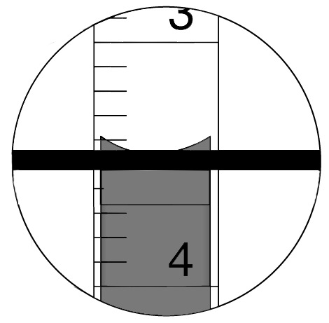

**Figure 1** - Illustration of the proper way to read the meniscus in volumetric measurements. The reading here would be 3.49 -- the final decimal place is estimated.

The calibration of a piece of glassware is irrelevant if the volume is not accurately read. This task is simple in plastic equipment: when the piece is held upright and level, the liquid surface will be flat and the level will be easy to read. Conversely, in a piece of glassware the surface of the liquid will adhere to the sides of the flask and form a curve, or meniscus. For almost all liquids, the meniscus is concave (downward curve) and the very bottom of the meniscus is read to determine the volume accurately ([Figure 1](#fig:meniscus)). On rare occasions, such as for mercury, the surface will curve upward (convex), and in this case the top of the meniscus is read to determine the volume.

When reading the meniscus, it is crucial that (1) the piece of glassware is stable and level, and (2) that the eye of the observer be level with the bottom (if the meniscus is concave) of the meniscus. Looking at the meniscus from a high vantage-point will result in a measurement that is also high. Conversely, if the meniscus is observed from below the level, the volume measurement will be lower than the true value.

Error introduced by reading the meniscus at the wrong level is called parallax and is easy to avoid by working carefully. There is an old adage in carpentry that goes "measure twice, cut once" and work in the lab is no different. Avoiding unnecessary sources of error often comes down to being careful about how the measurement is made, and it is always a good idea to check your value twice before recording the measurement.

### Precision volume measurements

Choosing the appropriate piece of glassware for measurements comes down to two main questions: what is the purpose of the measurement and what level of precision is needed? Glassware used to contain (TC) includes beakers, Erlenmeyer flasks, volumetric flasks, storage bottles, and test tubes. Of these, only volumetric flasks are used for precise measurement -- filling these to the line leads to a solution with precise volume to two decimal places (i.e., a 100-mL volumetric flask makes 100.00 mL of solution). To deliver (TD) glassware includes graduated cylinders, graduated pipettes, volumetric pipettes, transfer pipettes, and micropipettes. Volumetric pipettes, like volumetric flasks, deliver volumes with a precision of two decimal places (i.e., a 5-mL volumetric pipette delivers 5.00 mL of solution when used properly).

Graduated glassware -- such as graduated cylinders and graduated pipettes -- is read to one more decimal place than the graduations on the piece. Take, for example, a 50-mL burette with 0.1 mL graduations (each mL is marked with a number and there are ten tick marks spaced between each mL). Readings for a burette like this would always have two decimal places: the first is measured with the tick marks on the glassware and the second decimal place is estimated by the user. For instance, the reading of the solution in [Figure 1](#fig:meniscus) would be 3.49 -- the "3" corresponds to the major tick unit, the "4" is the minor tick unit on the glassware, and the "9" is estimated by the user based on their experience.

Fixed-volume volumetric glassware -- such as volumetric flasks and volumetric pipettes -- only have a single volume mark. These lines are located on a very narrow part of the piece of glassware and are usually calibrated to the second decimal place in the volume. The uncertainty in these pieces of glassware can either be found on the item itself or are provided by the manufacturer. For example, most 100-mL volumetric flasks are used to prepare a solution with volume $$100.00\pm 0.03$$ mL.

### Measurement leads to significant figures

Even novice users would be expected to estimate a second decimal place in the volume (in [Figure 1](#fig:meniscus)) and, hence, a third significant figure. This is actually the ***true origin*** of significant figures! In the value that you measured (3.49), there are two figures that you are very (completely) confident about: the 3 and the 4. While there is some uncertainty in the third figure (the 9), there is also some degree of confidence. Since the "9" is the first digit with uncertainty, it is the last figure about which we have significant information -- so it is the last **significant** figure. That would mean that the measurement 3.49 has three significant figures.

### Washing and rinsing equipment

Glassware in your locker should be clean from the last time that you used it and returned it to your locker. Rinse dirty glassware with small amounts of tap water several times. Use detergent only when you need to dislodge solid particles stuck to the glassware or for a thorough clean when it is warranted. After tap water, rinse the glassware with a small amount of deionized water. Always use deionized water from a squirt bottle, never directly from the tap. It is much more efficient to rinse with several small volumes than to wash once with a large volume. Finally, immediately before using a piece of glassware it should also be rinsed with a very small volume of the incoming solution.

*Important note*: if a piece of equipment has just been used with a hazardous chemical, then the first rinse (with water) is also considered hazardous waste and must be disposed of in the appropriate waste container. Subsequent rinses are not hazardous waste and should be disposed of down the drain.

## Mass Measurements with Analytical Balances

Analytical balances are the tool of choice for precise measurement of mass of samples. Unlike older mechanical balances that use physical counterweights to measure mass, electronic analytical balances use electromagnetic force to determine the mass of samples, often with extremely high degrees of precision. Typical analytical balances -- when used appropriately -- can determine the mass of a sample to within a tenth of a mg ($$\pm 0.1 \, {\rm mg}$$) or $$\pm 0.0001 \, {\rm g}$$. Top-loading balances, on the other hand, usually have a precision limit of $$\pm 0.01 \, {\rm g}$$.

In order to achieve the desired precision from analytical balances, they are often deployed to remote parts of the laboratory, often on special balance tables and in areas with less ventilation (to minimize air flow that will make steadying the balance more difficult). Additionally, analytical balances will typically have doors on the sides and top to minimize air flow around the sample.

### Proper use of analytical balances (direct measurement)

1.  A piece of weighing paper or a light-weight receiving vessel is placed on top of a tared balance. Record the mass of the paper (or vessel), and then tare the balance again with the paper or vessel on top.

2.  Remove the paper/vessel from the balance (the mass will go into the negatives, that is normal) and add sample. Do not add sample directly on the balance tray. Return the paper or vessel (with sample) to the balance tray, being careful not to let any solid fall.

3.  Close the doors to the balance and allow the balance to stabilize. Always avoid resting your books or materials on the balance table, and make sure to wait for the balance reading to stabilize. Record the mass of the sample.

### Proper use of analytical balances (mass by difference)

The above procedure accurately determines the mass added to the paper or vessel, but it does not necessarily represent the mass that is actually transferred to a second vessel. Consider the case of a relatively-sticky solid that you want to measure and transfer to a volumetric flask: it is very reasonable that some of the solid will remain on the weighing paper or in the weighing jar. This is a real concern even if the solid is not hygroscopic (absorbs moisture from the air) or visibly "sticky", and remains a concern even though we are using weighing paper that is designed to eliminate sticking.

In this case, we will prefer to use the weight (or mass) by difference method for mass determination. Here, we don't just measure the mass of the solid transferred to the paper or jar; rather, we measure how much is left after the solid is transferred to the next vessel. Let's examine a complete example of mass by difference. We start by taring the balance, and weighing the empty weighing jar ($$m_{\rm jar} = 25.0251 \, {\rm g}$$). The solid is added to the weighing jar, and the total mass is recorded ($$m_{\rm jar+solid} = 25.2449 \, {\rm g}$$). The solid is then carefully transferred to the vessel we want to use, and the "empty jar" (it isn't really empty as some solid will likely stick to the jar) is returned to the balance ($$m_{\rm empty} = 25.0288 \, {\rm g}$$). The mass of solid delivered is then $$m_{\rm jar+solid} - m_{\rm empty} = 0.2161 \, {\rm g}$$.

Notice in the example that the "emptied" jar weighs more than the clean jar did before we added solid. This is because some of the solid has remained in the jar, which means that had we not used mass by difference then we would have overestimated the mass delivered: 0.2198 g or 37 mg more than was actually delivered.

### Proper use and maintenance of analytical balances

- Because analytical balances are so sensitive, they will typically be kept in areas with low air flow and on balance tables that absorb vibrations from nearby motion. Out of courtesy for other users, be respectful and avoid slamming doors and placing large objects on the tables.

- To further minimize the air flow over small samples, analytical balances have full enclosures around the balance tray. Always have the doors closed before making a measurement or taring the balance.

- Never dispense solid directly to the balance tray. Always transfer solid to the weighing jar (or weighing paper) outside of the balance and then return the weighing jar to the balance tray. Getting solid between the tray and the edges will make the balance unusable until it is serviced.

- Bring all of your equipment with you to the balances and take them with you when you are done. Do not leave stock reagents near the balances. Leave balance areas cleaner than you found them.

- Report any balances that do not stabilize within 10-20 seconds to your lab instructor. They made need to be cleaned or re-calibrated.

### Correcting balance measurements for buoyancy

More modern analytical balances also use internal calibration weights to correct the balances for small variations (typically less than 0.3%) in the gravitational field on Earth. As a result, however, we introduce another complication: the densities of the sample and calibration weights are not the same. Consequently, the buoyant force of the air in the lab will contribute differently to the two samples.

The buoyancy equation is used to correct the mass reported by the balance ($m^{\prime}$) and calculate the true mass of the sample ($$m$$):

$$m = m^{\prime}\frac{\left(1-\frac{d_a}{d_w}\right)}{\left(1-\frac{d_a}{d}\right)} \tag{1}$$

where $$d_a$$ is the density of the air in the lab (0.0012 g/mL at SATP), $$d_w$$ is the density of the calibration weights (8.0000 g/mL), and $$d$$ is the density of the sample we are weighing. Note: the density constants do not limit the significant figures in your calculation.

## Micropipettes

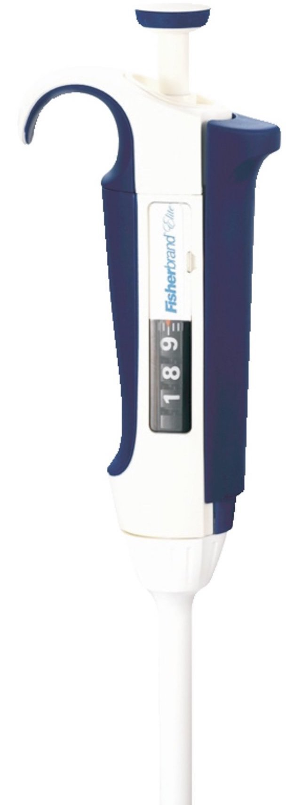

**Figure 2** - Pipette (tip not shown). Courtesy of Thermo Fisher Scientific. Reprinted by permission.

Pipettes are the tool of choice for precise transfer of liquids and solutions. Unlike graduate cylinders, which are not precisely nor accurately calibrated, pipettes can be extremely accurate and precise when used properly. Micropipettes are advantageous because they give the user a large amount of flexibility in the volume that is dispensed. A typical biochemistry or microbiology lab will have sets of micropipettes with different ranges of volumes ($$2 - 20 \, {\rm \mu L}$$, $$10 - 100 \, {\rm \mu L}$$, $$20 - 200 \, {\rm \mu L}$$, and $$100 - 1000 \, {\rm \mu L}$$ are the most common). In general, most micropipettes can be adjusted to deliver in increments of 0.1, 1, or 10 $${\rm \mu L}$$, depending on the maximum volume and design.

While having flexibility in volume is often very helpful, unfortunately there are also potential drawbacks to using micropipettes. First, continued changing of the volumes will cause the mechanism that allows for volume selection to become uncalibrated, which means that the more you use the micropipette, the less accurate the listed volume will be. The error caused by the drift in the mechanism will usually be small (no more than a few $${\rm \mu L}$$), but that can still lead to substantial bias in calculations that are made based on these volumes. For instance, it would not be uncommon for the 10-microliter setting of an uncalibrated pipette to deliver anywhere between 8 and 12 microliters -- correct to the same first significant figure, but a 20% error. This is why most research labs have their micropipettes calibrated by service companies at least once a year. While calibrating them is hard, detecting the error can be done easily with deionized water, a balance, and a thermometer.

Additionally, even when calibrated, using micropipettes can lead to large errors when they are not used properly. To achieve good results with a micropipette they need to be held completely vertically at all times, and slow deliberate movements are necessary.

### Proper use of micropipettes

Micropipettes fall into the category of equipment that look deceivingly-simple to use, but are actually way more difficult in reality. To properly transfer a liquid volume with a micropipette, use the following procedure:

1.  Micropipettes are expensive and fragile. Always hold a micropipette vertically, and never point the tip upwards or liquid will enter and irreparably damage the mechanism.

2.  Select the pipette with the smallest volume that will accommodate your volume needs. In general, the absolute error increases with the volume of the micropipette.

3.  Attach a tip of the correct maximum volume (listed on the tip box) to the bottom of the micropipette. Make sure that it is secure.

4.  Use the dial to set the aliquot volume. Never set the volume below the minimum listed setting or above the maximum setting (even though the dial will sometimes allow this), as this will badly affect the calibration of the micropipette.

5.  Loading the sample into the micropipette:

    1.  The plunger will stop at two different positions when it is depressed. Push the plunger down **slowly** to the point of first resistance ("first stop"). If you do not stop here, then you are transferring more than you want. The distance that you push to reach the first stop is dependent on the volume that you selected.

    2.  While holding the plunger at the first stop, dip the tip into the solution so that it is immersed just enough to cover the end of the tip (0.5 - 1 cm). **Do not** submerge all the way to the bottom.

    3.  **Slowly** release the plunger to withdraw liquid into the tip. Make sure that the tip remains immersed the whole time. *Important note*: the more viscous the liquid or solution, the longer you will need to allow for the solution to fill the tip. This can still take some time *after* you've finished releasing the plunger. Make sure that the total volume has entered the tip before removing it from the solution to avoid the presence of bubbles in the plastic tip, which will result in an inaccurate volume.

    4.  Visually inspect the tip to make sure that it looks correct. There should be no air at all in the bottom end of the tip.

6.  Dispensing the aliquot:

    1.  The "second stop" is when the plunger is depressed past the initial resistance (first stop), until the plunger is in contact with the top of the body of the pipette. The second stop is only used for dispensing, never for filling.

    2.  Dip the tip of the pipette into the vessel to which you intend to dispense the solution. Remember to keep the micropipette vertical at all times.

    3.  **Slowly** depress the plunger until the **first stop** (not second). Once you start applying pressure to dispense, do not relent on the pressure. **Wait** at the first stop for one second (longer for viscous solutions), until all of the solution has been dispensed.

    4.  After the short wait at the first stop, continue to press the plunger all the way to the **second stop** in order to force all of the liquid out of the tip. Wait one second.

    5.  **Important**: remove the tip of the micropipette from the vessel before releasing any pressure on the plunger (or you risk aspirating liquid back into the tip).

7.  The same tip can be reused for multiple aliquots of the same liquid or solution. Replace the tip when changing liquids. To discharge the tip, hold the tip over a waste receptacle and press down on the tip discharge slider (on the side of the micropipette).

### Dispensing very small volumes from micropipettes

With small volumes (1-20 microliters), it becomes very important to keep track of the individual droplets. Carefully expel the liquid droplet on the side wall of the vessel so that you can see it. As always, make sure to remove the tip before releasing pressure on the plunger or it is very likely that the drop will be disturbed.

When micropipetting this small volume to a larger volume (e.g., a dilution), it is best to flush the tip of the micropipette with some solvent after expelling the droplet. This "rinse" of the tip is then added to the dilution to ensure that the full volume has been delivered.

## Glass Transfer Pipettes

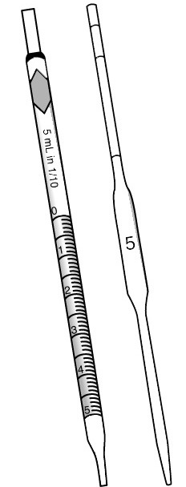

**Figure 3** - Two transfer pipettes: a measuring pipette (left) and volumetric pipette (right).

Pipettes are the tool of choice for precise transfer of liquids and solutions. Unlike graduate cylinders, which are not precisely nor accurately calibrated, pipettes can be extremely accurate and precise when used properly. In general, there are three types of pipettes: disposable, measuring, and volumetric. *Beral pipettes* are the most common type of disposable pipet. They are plastic and useful for transferring small volumes of liquid, though inaccurate. Beral pipettes are the ones that you should use to transfer unmeasured amounts of water and solutions.

The most variable of the precision pipettes are *measuring pipettes*, which are graduated over the entire volume of the pipette and are used to transfer variable volumes of liquids. In general, the graduations do not extend all the way to the tip. These pipettes are designed to be filled and then drained from one mark to another, and the volume is measured by recording the start and end volumes ([Figure 3](#fig:pipettes), left). *Serological pipettes* are measuring pipettes with graduations that extend all the way to the tip. Here, the volume is measured when filled and then the solution is delivered by allowing the liquid to freely drain from the pipette. A drop will remain in the tip of the pipette -- this is normal, and necessary! Never expel the last drop from the tip of a pipette.

*Volumetric pipettes* are by far the most precise pipettes for transferring liquids ([Figure 3](#fig:pipettes), right). They are made as a long, thin capillary with a larger bulb in the middle. They are used by filling the bulb and the capillary to the single calibration mark and then draining to deliver. Because the calibration mark is in the narrow capillary, volumes measured in these pipettes are the most accurate and precise.

### Proper use of transfer pipettes

To properly transfer a liquid volume with a pipette, use the following procedure:

1.  Attach a pipette bulb (or pipette controller) to the top of a pipette. Make sure to hold the top of the pipette near where it will enter the controller. Rotate the pipette gently as you slide it into the bulb or controller. Never force the pipette.

2.  If there is a bulb, squeeze the bulb to create negative pressure.

3.  Insert the pipette tip into the liquid and **slowly** release the pressure on the bulb to begin drawing liquid into the pipette. Make sure that the tip remains below the surface of liquid the whole time. Keep the pipette perfectly vertical at all times during use.

4.  If you are using a pipetter controller with precision controls:

    1.  Use the controller to draw up the desired volume of solution. Make sure to go slowly near the end and be careful not to get solution in the controller. Any solution enterring the controller will damage the mechanism.

    2.  Lift the pipette over the solution, holding the pipette vertically. Make sure that the volume level in the pipette has remained at the desired level.

    3.  Move the pipette over the receiving vessel and use the controller to dispense the solution.

    4.  **Never** blow out the tip of the pipet. Instead, simply touch the pipette tip to the side of the receiving flask to transfer the last hanging drop (Figure ).

5.  If you are using a pipette bulb or slide:

    1.  Fill the pipette past the desired volume and then quickly remove the bulb and place your gloved thumb over the top of the pipette.

    2.  Discard the excess liquid into a waste container by removing your thumb and allowing some liquid to drain from the tip.

    3.  Hold the pipette over the receiving vessel and remove your thumb. This time, allow the liquid to drain until the desired mark (measuring pipettes) or until all has drained to the very tip (serological and volumetric pipettes).

    4.  **Never** blow out the tip of the pipet. Instead, simply touch the pipette tip to the side of the receiving flask to transfer the last hanging drop ([Figure 4](#fig:serological)).

### Additional guidelines regarding proper pipette use

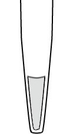

**Figure 4** - Serological pipettes are designed to leave a small amount of solution in the tip. Do not dispense this extra volume of solution.

Pipettes must be properly rinsed before the are used. In general, pipettes are rinsed with water as well as the solution that they will then dispense. The first rinse (with deionized water) should involve approximately 20% of the pipette's volume, while the second rinse (with the solution to be dispensed) should use approximately 10% of pipette volume.

After using a pipette, clean the pipette with two small portions of water, the first of which is considered hazardous waste. Failure to clean the pipette after use can result in solid building up in the pipette that will make the pipette much more difficult to clean at a later stage. If solid does build up in the pipette, consult your instructor for how to clean the pipette.

Remember to never blow out the tip of the pipette, as they are calibrated to retain a small amount of liquid in the vert tip after the solution has been dispensed ([Figure 4](#fig:serological)). Dispensing this amount of liquid along with your aliquot will lead to a significant error in the volume dispensed.

Finally, make sure to be extra careful when loading a pipette to slow down near the end and to never draw liquid into the controller mechanism or bulb. In the case of bulbs, this will cause the bulb to become contaminated. The controllers, on the other hand, can become irreversibly damaged if liquid is drawn up into the mechanism.

## Volumetric Flasks

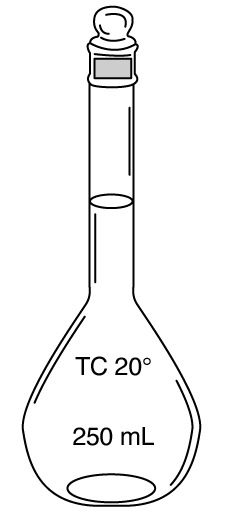

**Figure 5** - Volumetric flasks are used to prepare solutions with precise volumes.

Volumetric flasks are the most common piece of glassware used to make solutions and dilutions. They are comprised of a large glass bulb base and a narrow neck with a calibration mark. Unlike beakers and Erlenmeyer flasks, which have large necks and are not well calibrated, the narrow neck of the volumetric flask enables us to make very precise solutions. This advantage in precision and accuracy is mitigated by the fact that any given volumetric flask is only calibrated to a single volume, unlike the others mentioned. That said, any time a solution needs to be prepared with an accurate volume, it should be made in a volumetric flask.

### Proper use of volumetric flasks

To prepare a solution in a volumetric flask:

1.  Obtain a clean volumetric flask.

2.  Transfer a precisely-measured amount of a solid (by difference), liquid, or solution (using pipettes) into the volumetric flask.

3.  Add solvent until about halfway to the top of the bulb (not the neck).

4.  Cover the flask, with the cap or Parafilm and a gloved finger, and mix the contents well (at least 10 inversions, rapidly). Remember to release any pressure that builds up in the flask by removing the cap periodically.

5.  Continue to fill the flask to the calibration mark. As you approach the end, use a small disposable pipette to make sure not to overshoot the line. Keep your eyes at meniscus-level to avoid parallax error. See section A.2.

6.  Mix the solution well by inverting and shaking multiple times.

7.  Transfer the solution to a clean storage bottle to free up the volumetric flask.

*Important note*: as long as you don't need 100% of the solution volume that you just made, it is advisable to rinse the storage bottle with a small volume (less than 5-10 mL) of the incoming solution before transferring.

### Additional details relating to volumetric flask use

- Rinsing and cleaning: rinse or clean the flask with a small volume (10-15 mL) of solvent, twice. The first rinse should be disposed of into the hazardous waste.

- Remember to half-fill the flask and mix well. Then, slowly add solvent to the line with using a Beral transfer pipette. Always have your eyes at the level of the line so that you can properly judge the meniscus at the line. Mix very well after adding the final amount of solvent.

### Preparing and using diagrams for subsequent dilutions

It is frequently the case that you will need to prepare a series of *subsequent dilutions* -- a solution that is diluted several times using different volumes of solution transfered and diluted volumes. Sometimes this is done in order to sufficiently dilute an initial solution of known concentration. In other cases, the goal is to learn about the original solution by measuring some quantity about the final solution. In either case, the various volumes of pipettes and volumetric flasks can make these calculations tricky to visualize and perform. One of the more powerful approaches to these calculations involves first sketching a diagram for the subsequent dilutions and then working backwards on the dilutions.

Consider the following example: a sample with an unknown number of moles is transfered to a 100 mL volumetric flask and diluted (solution A). A 5 mL sample of solution A is then transfered to a second 100 mL volumetric flask and diluted (solution B). A 25 mL sample of solution B is then transfered to a 500 mL volumetric flask and diluted (solution C). The concentration of solution C is found to be 3 mM. This process is diagramed in [Figure 6](#fig:dilutionsfig).

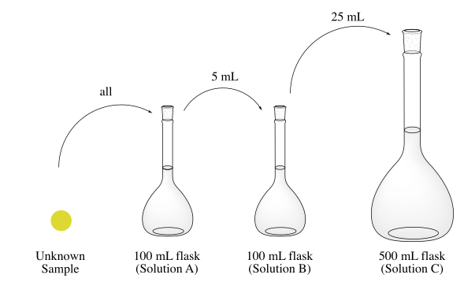

**Figure 6** - Sketch of the dilution of a sample through three subsequent dilutions. This sketch can be used effectively to learn about the original sample using the concentration of the most dilute (Solution C).

To determine the number of moles in the unknown sample, we start by determining the number of moles of solute in solution C:

$$n_{\rm C} = [{\rm C}]\times V_{\rm C} = \left(3 \, \frac{\rm mmol}{\rm L}\right) \left({\rm 0.5\,L}\right) = 1.5\, {\rm mmol} \tag{2}$$

We know that the 1.5 mmol of solute in solution C is the result of having transfered 25 mL of solution B. In other words, the 25 mL sample of B contains 1.5 mmol. We can therefore conclude that the entirety of solution B (before removing the 25 mL sample) must have contained 6 mmol:

$$n_{\rm B} = n_{\rm C}\times\frac{V_{\rm B,total}}{V_{\rm B,transfered}} = \left({\rm 1.5\,mmol}\right) \left(\frac{100 \, {\rm mL}}{25 \, {\rm mL}} \right) = 6\, {\rm mmol} \tag{3}$$

The same process will get us the number of moles of solute in A:

$$n_{\rm A} = \left({\rm 6\,mmol}\right) \left(\frac{100 \, {\rm mL}}{5 \, {\rm mL}} \right) = 120\, {\rm mmol} = 0.120\,{\rm mol} \tag{4}$$

Finally, because solution A is made with all of the unknown sample, we conclude that the sample must have contained 0.120 moles of solute. Note: the significant figures for the dilution calculations are determined by the precision of the glassware. The final answer has three significant figures because a 5-mL pipette has three significant figures (5.00 mL). If we desire to know the concentrations of solutions A and B, we can divide the moles of solute in each by their volumes. That would make the concentrations solutions A and B, 0.06 M and 1.20 M, respectively.

## Burettes

Volumetric pipettes are the most appropriate piece for glassware for delivering a fixed volume of liquid or solution. When the volume of solution that is needed is not known, or is likely to change, burettes are used to transfer the solution. Burettes are long, narrow cylinders that allow the user the flexibility to deliver variable volumes of solution, multiple increments of solution in rapid succession, and easy control over the rate at which solution is delivered. Consequently, burettes are the tool of choice for titrations.

A 50-mL burette has large, numbered graduations at 1-mL increments, but they also have smaller graduations at the 0.1-mL intervals. As a result, volumes measured on burettes should be read to two decimal places: the first decimal place is the 0.1-mL graduation and the second is an estimate of how far between the graduations the meniscus is located (at the line, 0; almost half-way, 3; half-way, 5; or almost to the next line, 7). See [Reading volume measurements on glassware](#reading-volume-measurements-on-glassware) above.

The largest downside to using burettes is that each time a volume is delivered, two measurements (with associated error, $$\pm 0.03 \, {\rm mL}$$ for a 50-mL burette) are required. While this does increase the possibility for adding unwanted experiment error, or mistakes, burettes remain one of the most useful and reliable pieces of glassware for volumetric transfer.

### Cleaning and filling burettes

1.  If a color change is expected, use a burette stand with a white base or put white paper underneath the flask to aid in visualizing the endpoint properly.

2.  Clamp the burette towards the middle of the cylinder to avoid causing unnecessary stress on the glassware. Be careful not to pull the burette as you use it.

3.  Before clamping it in place, rinse a clean burette with a small amount deionized water (~5 mL). Swirl the water all around the sides of the burette, rotating and partially-inverting, and drain the water through the stopcock.

4.  **Repeat** the rinse with a small (~5 mL) volume of the incoming solution, and drain through the stopcock.

5.  Use a small (clean) glass funnel to fill the burette. Always remove the funnel before reading the volume and titrating (to avoid drips changing the volume).

6.  Make sure that there is no air bubble lodged between the bottom of the stopcock inside the tip. Gentle tapping while slowly dispensing removes air bubbles.

### Titrating and dispensing from burettes

1.  Use an Erlenmeyer flask to hold the sample being titrated, in order to avoid drops landing outside of the solution. If you need room for a pH probe in your sample, use a beaker.

2.  Burette stands with white bases are helpful in visualizing the endpoint of titrations when there is a color change. Alternatively, use a piece of white paper under your flask to increase the contrast.

3.  Make sure to remove the filling funnel before starting to titrate or dispense.

4.  Check to make sure that the burette tip is free of air bubbles before starting, as these could become dislodged during the titration, affecting the accuracy.

5.  Recall: burettes should always be read to two decimal places -- the second place is estimated ([see Reading volume measurements on glassware above](#reading-volume-measurements-on-glassware)).

6.  The burette tip should be inside the mouth of the flask to avoid splashing of solution outside the flask.

7.  For titrations: initially, the titrant should be added rapidly until greater than 90% of the pilot titration volume is added (in one shot without stopping). Swirl the receiving flask while the solution is being added. For right-handed people, it is easier to do the swirling with the right hand while grasping the stopcock with the left hand. Orient the stopcock to be on the right of the burette and use the thumb, second, and third fingers of the left hand encircling the stopcock. This seems awkward at first, but it allows careful control of the stopcock without having to switch hands all the time. If you are left-handed, do the reverse.

8.  Swirl the flask to encourage proper mixing and to wash down splashes of titrant and indicator on the flask walls. Use a squirt bottle of deionized water to wash in any drips near the top of the flask that are inaccessible from swirling.

9.  Near the end of the titration you will need to add the titrant more slowly. When nearly at the endpoint, add titrant drop by drop, even splitting drops by touching the burette tip to the flask wall and rinsing down with a squirt of deionized water.

10. It is very important to make sure that you do not overshoot the endpoint. For example, the endpoint of a NaOH/HCl titration with phenolphthalein indicator is the first faint pinkish color that persists after swirling. The pink color may disappear after prolonged swirling, but as long as a faint pinkish color persists for 15 seconds or so the endpoint has been reached.

11. It is a good idea to keep initial trials during replicate titrations. That way, the endpoint colors can be compared to get consistent endpoints.

### Additional details relating to proper burette use

- It is not necessary to completely fill a burette. If you know that you will not need a large volume, consider filling it with only 10-25% more volume than you anticipate using. Never return solution from a burette to stock bottles. If you have a large volume remaining when you're done, ask your instructor if you should save it (with Parafilm) for another student.

- If you are titrating with an indicator, always use the same amount of indicator in repeat trials of a titration.

- When titrating solids, masses should be recorded to as many decimal places as possible, but rarely (if ever) need to be exactly the mass specified in the procedure. For example, 0.1928 g is a perfectly good mass to use if you were instructed to titrate 0.2 g. It is not acceptable, however, to stay extra time at the balances (monopolizing them from other students) in order to weigh out exactly 0.2000 g.

## Accumet AB150 Model pH Meters

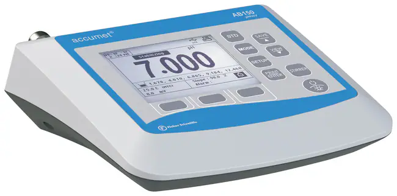

**Figure 7** - AB150 pH meter. Courtesy of Thermo Fisher Scientific. Reprinted by permission.

A pH meter is an instrument that measures the hydrogen-ion activity (concentration for dilute solutions) in aqueous solutions. The pH meter measures the difference in electrical potential between a pH electrode and a reference electrode, and so the pH meter is sometimes referred to as a *potentiometric pH meter*. The difference in electrical potential is directly related to the pH of the solution.

### Proper care and use of pH meters

- The pH probes are very delicate and fragile. To that end:

  - Never touch the sides or bottom of a container with the probe

  - Never directly touch the glass bead in the probe head

  - Do not use the probe for stirring solutions

  - Keep probes upright at all times (even for storage) and the small hole on the side at the top should remain closed at all times

- Always calibrate a pH probe before starting to use it. After calibration, do not press the buttons again during use.

- Avoid lifting the probe out of the solution between measurements, as it will slow down the diffusion of the ions into the probe

- To make multiple measurements in a row: swirl/stir the solution after an addition, and then stop and wait for the pH reading.

- Do not wait for the probes to equilibrate past 7-10 seconds. Often, the pH will continue to fluctuate. If after 10 seconds the probe is still fluctuating between 2-3 adjacent values, record the average and proceed.

- Always make sure that the probe storage bottle is filled with pH probe storage buffer. Ask your instructor if you need more storage buffer (not the same as calibration buffers)

### Calibrating the AB150 pH meter using buffer solutions

A new calibration must be performed at the beginning of any experiment. Follow these steps to remove previous calibrations and re-calibrate.

1.  Press and release the `MODE` key ([Figure 8](#fig:pHmeter2)) until the display indicates pH mode. Remove the probe from buffer before starting.

2.  Rinse the probe head into waste and gently touch (don't press) a Kimwipe to the tip to remove water.

3.  Immerse the electrode into the first buffer solution (e.g., pH 4 buffer). Stir moderately for a few seconds.

4.  Press `STD` to access "Standardize" mode

5.  Press `CLEAR` while in standardization mode to clear to previous standardization.

6.  Wait for the pH reading to stabilize (5-10 seconds) and the `Stable` indicator appears on the screen. The meter will automatically recognize the buffer.

7.  Press `STD` again to store the pH value for the buffer.

8.  Rinse the probe again and repeat steps 6 and 7 for the remaining buffers (e.g., pH 7 and 10 buffers). Always standardize using at least two buffer solutions, spanning close to the range of pH values that you will use in your experiment.

9.  After each additional buffer, the meter will briefly display the percent slope that tells you about the performance of the probe. If the slope is between 90 and 102% then the electrode is good. If not, it will display a warning. If you get an error or warning, repeat the standardization. If the error persists, consult your instructor (and check the buffers).

10. Once your standardization is complete, do not press `STD`. Dip the probe into solutions to measure the pH.

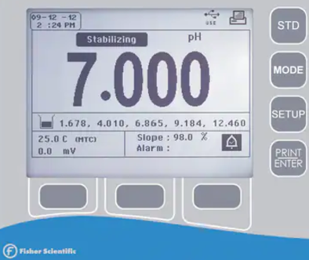

**Figure 8** - Accumet AB150 pH meter screen, including command keys on the side. Courtesy of Thermo Fisher Scientific. Reprinted by permission.

## Spectronic 200 Visible-light Bench-top Spectrophotometer

The Spectronic 200 bench-top spectrophotometer is a low-cost, easy-to-use instrument for in-lab measurements. While not as accurate as research-grade instruments, it is a good choice for quick measurements and kinetics experiments.

There are two very useful modes that the Spectronic 200 offers for quick measurements in the lab. The "Spectrum scan" mode gives a low-resolution (1 nm) spectrum in the visible region of the spectrum. Using spectrum scan you can get a quick look at the overall visible-light spectrum of a sample in the lab. The "Live Display" mode is useful for rapid monitoring of a single wavelength, such as for kinetics experiments. Even for kinetics experiments, however, you will always start with a spectrum scan to decide what wavelength to study. The mode is selected using the left and right keys ($$\leftarrow$$ and $$\rightarrow$$).

### Spectrum Scan Mode

1.  The Spectrum Scan setup screen is shown in [Figure 9](#fig:spec200_1) (left). Use the up and down arrow keys to select (the text turns green to show which option is selected) *Measurement Mode*, and then use the right and left arrow keys to toggle between %T (transmittance) or Abs (absorbance). Set the spectrum limits by selecting *Low $$\lambda$$* or *High $$\lambda$$*, and then use the left and right arrow keys (or the $$\lambda$$ knob) to adjust.

2.  Use the arrow keys to select *Next*, then press ENTER to enter Scan mode ([Figure 9](#fig:spec200_1), right). Pressing the ENTER key on the keypad when *Application* is selected has the same effect as selecting *Next* and pressing the ENTER key.

3.  Place a blank solution cuvette in the sample holder and press the 0.00 button (Auto zero) before measuring any sample cuvettes.

4.  Press ENTER to scan across the selected wavelength range. Press the Up arrow key to return to the scan menu. You can zoom in on the spectrum using the Down arrow key.

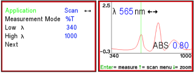

**Figure 9** - Spectronic 200 Scan setup screen (left) and scan mode screen (right). Courtesy of Thermo Fisher Scientific. Reprinted by permission.

### Live Display Mode

1.  Use the up and down arrow keys to select *Measurement Mode* and then the right and left arrow keys to toggle between %T or Abs. Select *Measurement $$\lambda$$* and use the left and right arrow keys or the $$\lambda$$ knob to set your desired measurement wavelength ([Figure 10](#fig:spec200_2), left).

2.  Use the arrow keys to select *GO*, then press ENTER to start the Live Display mode ([Figure 10](#fig:spec200_2), right).

3.  Place a blank solution cuvette in the sample holder and press the 0.00 button to blank the device.

4.  The displayed value (either in %T or Abs) updates every 2 to 5 seconds (depending on the wavelength). Change the wavelength using the $$\lambda$$ knob or the left and right keys, if desired. A triangle marker and white line on the spectrum at the bottom of the screen show the color of the light presently being measured.

5.  To freeze the display, press the ENTER key. When the display is frozen, the measurement values are not being updated. Press ENTER again to resume measurements.

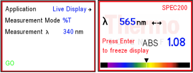

**Figure 10** - Spectronic 200 Live display setup screen (left) and Live display mode screen (right). Courtesy of Thermo Fisher Scientific. Reprinted by permission.

### General guidelines for use of Spectronic 200 instruments

- Unlike more expensive instruments, stray light poses a substantial problem for bench-top units. Make sure to keep the lid closed at all times when recording data or blanks.

- Similarly, the bench-top units can experience drift and lose calibration after sitting for enough time. Periodically check to make sure that the baseline remains good, and re-blank the instrument as needed.

- Finally, there is no need to use expensive quartz cuvettes with the Spectronic 200. Since the instrument only functions in the visible-region of the spectrum, precision plastic cuvettes and glass cuvettes work well.

## Cary 60 UV-Visible Spectrophotometer

The Cary 60 UV-Vis Spectrophotometer is a research-grade instrument with enough efficiency and accuracy for any experiment. The xenon flash bulb allows users to record spectra across the full ultraviolet and visible spectrum (from 190 to 1100 nm), recording 80 data points per second.

### Logging on to the Cary 60

1.  Make sure that the instrument is powered on (button on the bottom, right-hand corner of the front of the instrument), and that the power light is green, prior to starting the computer. The Cary 60 uses a xenon flash bulb as a light source and therefore *does not need to be turned off* -- never turn off the instrument.

2.  Login to the computer using your (instructor or student) BU login and password.

3.  A folder on the desktop contains links to the various Cary 60 applications. Complete UV/Vis spectra are recorded using the Scan application. After starting the Scan application, you will be on the home screen (Figure ). If the "Start" button (Figure , A) on the top of the screen is absent (or if it is replaced with a "Connect" button), seek assistance from your instructor immediately.

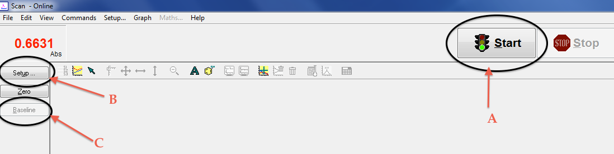

**Figure 11** - Cary 60 Scan application's home screen.

### Setting the scan parameters

1.  Click the "Setup" button ([Figure 11](#fig:cary60_home), B) to enter the basic setup screen ([Figure 12](#fig:cary60_setup1)).

2.  The basic setup screen allows the user to access many of the critical scan parameters: wavelength limits, *y*-axis mode (Absorbance, Transmittance), scan rate, and more. Start by adjusting the wavelength settings ([Figure 12](#fig:cary60_setup1), A) to the range of wavelengths that you would like scanned. Notice: the instrument starts scanning at large, visible wavelengths. Remember: if you are using a plastic cuvette, including the UV range is inappropriate.

3.  One of the 'selling points' of the Cary 60 is the speed of the instrument. The way that this is accomplished is by setting the default scan to record every 5 nm -- much too infrequent to be useful. To adjust the scan rate, select "Advanced" under Scan Controls ([Figure 12](#fig:cary60_setup1), B).

4.  The advanced scan screen ([Figure 13](#fig:cary60_setup2), left) will allow you to adjust the data interval or the scan rate; changing one of them will automatically adjust the other. Change the "Data Interval" ([Figure 13](#fig:cary60_setup2), left, A) to something more reasonable (less than 0.5 nm; the instrument's limit is 0.15 nm).

5.  Next, click on the "Baseline" tab ([Figure 13](#fig:cary60_setup2), left, B) at the top of the window. The baseline tab ([Figure 13](#fig:cary60_setup2), right) is used to set the baseline, or zero, correction. Select "Zero/baseline correction" ([Figure 13](#fig:cary60_setup2), right).

6.  Click the "OK" button at the bottom of the window. A pop-up window will appear to inform you that you do not have a valid baseline recorded ([Figure 14](#fig:cary60_baseline), left). Click "OK" to dismiss this window and proceed to record the new baseline and zero.

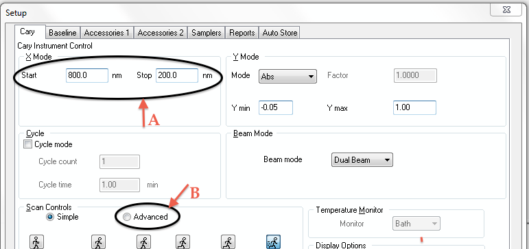

**Figure 12** - The basic setup dialog box starting screen.

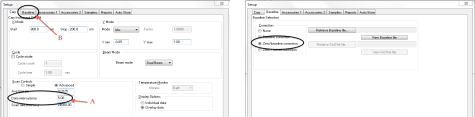

**Figure 13** - Advanced scan controls dialog box (left) and the baseline tab dialog box (right).

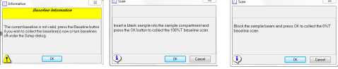

**Figure 14** - Baseline pop-up window (left), baseline scan dialog box (middle), and zero transmittance dialog box (right).

### Recording the instrument baseline and zero

1.  Click the "Baseline" button ([Figure 11](#fig:cary60_home), C). The software will now guide you through the process of recording the instrument baseline and the zero. Insert your blank solution (or an empty cuvette) into the sample holder and click OK ([Figure 14](#fig:cary60_baseline), middle).

2.  When the baseline is done being recorded, the instrument will ask you to record the zero ([Figure 14](#fig:cary60_baseline), right). Follow the on-screen instructions and use a completely opaque material (like your hand) to cover the beam and click "OK."

### Recording spectra

1.  Click "Start" ([Figure 11](#fig:cary60_home), A) to begin collecting spectra. The instrument will start by asking you to choose the location and name of the data file to save ([Figure 15](#fig:cary60_filename1)). Navigate to your USB thumb drive's folder and name the data file something sensible. Click "Save" ([Figure 15](#fig:cary60_filename1)).

2.  A new dialog box will now appear ([Figure 16](#fig:cary60_filename2)). Enter the name of your first sample in the Sample Name field ([Figure 16](#fig:cary60_filename2), A). Make sure that the name is descriptive, as all of the spectra will eventually be saved to the same file. Click "OK" ([Figure 16](#fig:cary60_filename2), B) to begin recording the spectrum. When the instrument has completed, the same dialog box ([Figure 16](#fig:cary60_filename2)) will reappear.

3.  Repeat the previous step for each of your samples. When you are done with all of your samples, click "Finish" ([Figure 16](#fig:cary60_filename2), C).

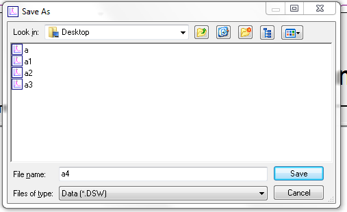

**Figure 15** - Naming the data file dialog box.

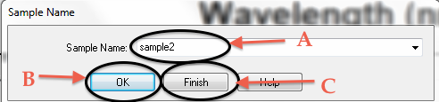

**Figure 16** - Sample name dialog box.

### Exporting the data in CSV format

1.  To save your data in a format that is readable by Microsoft Excel, click on the "File" menu on the top of [Figure 11](#fig:cary60_home), and then "Save As."

2.  The dialog box that appears ([Figure 17](#fig:cary60_saveas)) will ask you for the name and file type. Navigate to your folder and name the file. Set the file type to Spreadsheet Ascii (\*.CSV) using the "Files of type" drop-down menu ([Figure 17](#fig:cary60_saveas)). Click "Save."

3.  *Important note*: CSV files are not Excel files. You will need to import this file as "Comma Delimited Text." Specific instructions for how to successfully import CSV files in your version of Excel can be found by searching the internet. Once you've successfully opened the file on your computer, save a copy of the data in Excel workbook format. Never work directly from raw data files.

> **Warning:** your computer does not have the ability to read the spectral data files that you've just saved. You must export the data in CSV format in order for the files to be readable on your personal computer.

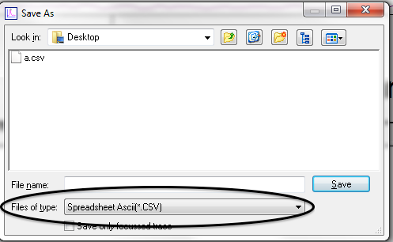

**Figure 17** - Save As dialog box.

### General guidelines for use of Cary 60 Spectrophotometers

- Never touch the instrument computer's keyboard with gloved hands. Remove one glove for operating the keyboard, and leave one hand with safety gloves for working with samples.

- Be careful not to spill hazardous chemicals in the sample chamber of the Cary 60 instruments, as exposure can cause damage to the cuvette holder and instrument.

- The Cary 60 instrument construction eliminates concerns about stray light. The instrument can be operated without loss of reliability without being covered, but the included cover can be secured for long-term experiments of light-sensitive species.

- When the Cary 60 is used for recording spectra in the UV region of the spectrum, quartz cuvettes must be used instead of plastic or glass cuvettes.

- Make sure to familiarize yourself with the direction of the light beam through the instrument. Always load the cuvette in the correct orientation.

- Always double-check that you've exported your data in CSV format. The instrument's default file format is not readable on other computers.

- Make sure to bring a USB flash drive to collect data from the Cary 60 instruments. A limited supply of loaner drives may be available from your instructor, but it is best to make sure to have your own drive. Note: the Cary 60 computers have USB type-A ports; most modern devices use USB type-C, so a double-sided USB-A/USB-C drive is recommended.

## ChemDoodle

While word-processing packages, like Microsoft Word, can be easily used to write balanced equations for inorganic chemistry reactions -- where the three-dimensional structures of the species are not generally necessary or included. For organic chemistry reactions, however, it is highly desirable that the equations included in papers show the structure of the chemical species.

Software packages like ChemDoodle allow users to draw chemical reactions that can be included as images in documents. In addition to other robust features, these packages also enable users to draw complete reactions and reaction mechanisms.

### Downloading and installing ChemDoodle

The Chemistry Department at Boston University maintains a full site license for these packages, which means that all students are eligible to sign-up for an account and download the software to their personal computers using their `@bu.edu` email address. The software and licenses may need to be updated periodically (typically, every year), but the starting place is always the same.

You can request a license and then download the software following this link: https://www.ichemlabs.com/support/request-site-code