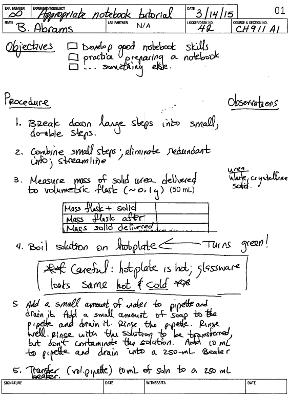

# Laboratory Research Notebooks

* TOC
{:toc}

Proper academic and industrial lab practices require that all work in labs be done directly from a lab research notebook. These documents, while not published like journal articles, are the backbone of scientific inquiry and discovery, and they must contain the complete and unaltered record of the work that is done in the lab. A lab research notebook will contain the complete record of the experiments that were performed, including the procedures, reagents, and data. These records are then used to pass on information to the next researchers on a project, serve as legal documentation for proving intellectual property (when applying for patents), eliminate concerns over potential fraud, and are a legacy for the research group.

Long after a particular researcher has moved on from the research group, the lab notebook will remain as a crucial reference source for future work. While it is doubtful that the work done in undergraduate lab courses will be needed for future reference, the skills of keeping these notebooks will be useful as you venture forth into research positions, including undergraduate research. As such, it is crucial that you begin to develop proper habits for documenting your work in lab research notebooks.

To begin developing these skills, all lab work for this course will be done in a research notebook, and the duplicate pages will be submitted to your instructor before leaving the lab so that they can provide feedback, guidance, and direction. Moreover, since all of your work will be done from pre-prepared notebooks, use of this lab manual will not be permitted in class during the experiment; that said, you should still bring your manual with you so that you can refer to it during the analysis time at the end of labs.

## Preparing research notebooks ahead of work in the lab 

Proper preparation of your research notebook is the best way to make sure that you will be ready to do your experiment with confidence and fidelity to your planned protocol. A substantial portion of the notebook pages needs to be completed before arriving at the lab so that you are prepared and organized in your work. Details needed before lab include:

- The title of experiment, your name, the date, and your lab section. These details need to appear on all pages, not just the first page.

- An objective statement. This can either be a bulleted list of the in-lab outcomes and goals, or a *very brief* paragraph describing the outcomes. A bulleted list is typically more useful and will enable you to check your progress as you go. These objectives should include the specific experimental outcomes that you hope to achieve.

- A detailed procedure. Most often you will be following a procedure that has been provided to you. In this case there is no need for you to copy the procedure verbatim; rather, make sure that the procedure you write is detailed enough for you to follow and includes all of the pertinent details that are necessary. Add extra details where you think you might need them, and omit others that you find to be overly verbose. Make sure to diagram any apparatus that will be used, if applicable. For multiple dilutions it will help to diagram or sketch these dilutions (to make sure that they are clear).

- Safety information and potential hazards. Labs can be a dangerous place, and knowing about the potential hazards in advance is the best way to avoid potentially-harmful situations. Any and all chemical, or physical, hazards related to the experiment must be listed and explained **inside the procedure**. Consider making 'warning' boxes in your procedure.

- Waste handling instructions. A detailed description of how all the waste components will be handled. This must be include inside your procedure write-up, not at the end.

- Data tables. Tables, placed next to the procedural steps that are relevant to the data collection, for the values that you expect to collect/measure must be prepared **in advance** of the lab session. This is the best way to make sure that you will have all of the information that you need once you leave the lab. In the fast-paced, sometimes nerve-wracking, laboratory setting it is easy to miss important details; having tables set up in-advance allows you to see, at a quick glance, what exactly you'll need to record.

- Observations. While these observations will be made during the performance of the experiment, make sure to leave ample room for you to document what you observe as your do the experiment.

## Examining a sample notebook entry

**Figure 1** - Sample notebook entry that highlights important aspects to a successful research notebook.

The sample notebook entry in [Figure 1](#fig:notebooksample) highlights a few important things to keep in mind when preparing your lab notebook. Specifically:

- All of the important information at the top has been filled-in, on all pages, *before* lab.

- Objectives are listed in a concise way that allows the student to easily identify objectives left to complete.

- Appropriate room for observations is left next to the procedure, and the observations made in lab are detailed enough to be understandable. Some students prepare their notebook pages in one color pen (black ink, for instance) and make observations and record data in another (red or blue ink) -- this can be very helpful for working with your notes.

- Tables are prepared, before coming to lab, for all of the data that will need to be recorded.

- Waste and safety concerns are listed inside the procedure.

It is also important to note that procedure is written in a way that the student can easily follow -- a lot of details when necessary and fewer details when appropriate. Notice the two versions of step #5; it is likely that the first version might show up early on in the year, whereas the second version would be used as the student develops more comfort and confidence.

## Working with research notebooks in the lab 

In the lab, all work must be done directly from and in the lab notebook -- this includes recording all data, including seemingly insignificant information and observations. For professionals, this is to ensure the strongest levels of integrity. For students, this is good training for future research positions, and limited reliance on memory. The following items are added to your research notebook during the experiment:

- Name(s) of any co-investigators that are actively working with you on a protocol (lab partners) or supervisor (if applicable).

- Observations. A researcher needs to take detailed notes and write their observations during an experiment -- both planned and unplanned information. Actual times, colors and color changes, temperatures, and deviations from the written procedure are some of the observations that you should be making in the lab. These are immeasurably helpful for people who will want to reproduce your work and for yourself. Needless to say, all data must be recorded in the notebook.

- Data. All data must be recorded **directly into the notebook** using the tables that were constructed before the lab. This includes masses, volumes, and other exact measurements that are recorded in the lab. Data or spectra recorded on instruments should be mentioned in the notebook pages and a note about where it is stored. Always keep an unedited copy of all data files, and work from the copy.

- Calculations. It is sometimes helpful, though not always necessary, to perform some preliminary calculations in your notebook. Include interpretations of those data, when applicable.

- Instruments. It is important to note pertinent details about instruments used in an experiment when the choice of instrument has a potential impact on the experiment. Glassware (burettes, pipettes, etc.) is rarely included in this category. Conversely, things like spectrophotometers, pH meters, thermometers, centrifuges, and cell culture tables should all be well-documented -- including make, model, and settings used.

## General notebook practices and guidelines 

- Entries must be written in pen, not pencil. Never use error correction fluid or pens.

- When you make errors, simply draw a line through the incorrect entry and enter the correct information. Do not scribble. Write your initials next to the correction and include the data the correction was made. It is also useful to provide a reason for the correction, if applicable.

- Never remove a page from a research notebook (except for the duplicate copies that are submitted in lab courses), and never skip pages. If you accidentally skip a page, or make a large mistake, cross out the page and provide an explanation.

- The entries should be legible, and information should be organized and clearly labeled.

- Use lots of space. Lab notebook should be geared toward functionality and legibility, not saving space.

- Make a note in your observations about any data that is recorded on external instruments. Include a description of what is recorded, where it is saved, and the filename.

- Always include the make and model of analytical instrumentation (spectrometers, pH meters, etc. -- pretty much anything that uses electricity). Also, make sure to document the specific instrument parameters that are used in your experiment (calibrations, sampling frequency, etc.).

- Students will submit the duplicate pages of their research notebooks before leaving the lab. You should submit the copies (not the originals), as you will want the originals -- which are easier to read -- to work from after the lab.