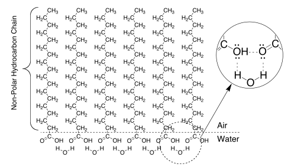

# Molecular Size Determination

## Introduction 

The ability to perform quantitative experimentation in the chemistry laboratory is dependent on our ability to accurately *count* the molecules involved in a given chemical system or reaction. For instance, one liter of an ideal gas at room temperature will be composed of approximately  gas molecules. The need to count large numbers of molecules (on the order of $10^{23}$) in order to perform quantitative experiments would be very cumbersome.

Mass, while useful for indicating the total amount of matter present, cannot by itself be used as a measure of the number of atoms or molecules. Rather, we use the molar mass (mass of exactly one mole of a substance) to determine the number of items. A 'mole' is similar to a dozen. Both are grouping of items that can be used conveniently to avoid counting large numbers of items. A mole of items is equivalent to $$N_A$$ items, where $$N_A$$ is *Avogadro's constant* (or Avogadro's number).

Unlike many of the constants that you've seen before, such as the speed of light or Planck's constant, Avogadro's number is not fundamental; rather, $$N_A$$ is a defined quantity based on the number of carbon-12 atoms in 12 g of $${\rm ^{12}C}$$. Specifically, 12 g of $${\rm ^{12}C}$$ is defined as containing exactly 1 mole of $${\rm ^{12}C}$$ atoms. The actual mass of a single carbon-12 atom is $$1.99265 \times 10^{-23}$$ g, which means that the number of atoms in a mole is 

$$N_A = \frac{\rm 12\;g / mole}{\rm 1.99265\times 10^{-23}\;g} = 6.022 \times 10^{23} / {\rm mole}. \tag{1}$$

In this experiment we will use Avogadro's constant to estimate the surface area of the head (polar portion) of a molecule of stearic acid. The procedure will involve preparing a single-layer film, known as a monolayer, of known area over the surface of a Petri dish. Long-chain fatty acid molecules, such as stearic acid $${\rm C_{18}H_{36}O_{2}}$$, spread on a water surface to form a monolayer with polar carboxylic acid groups $${\rm-CO_{2}H}$$ in the aqueous phase and non-polar hydrocarbon chains aligned vertically in the air, as shown in [Figure 1](#fig:monofilm).

**Figure 1** - Monomolecular film of stearic acid $${\rm C_{18}H_{36}O_{2}}$$ at an air/water interface.

Imagine that the above arrangement extends in two dimensions across the entire water surface. This monomolecular film forms spontaneously because weak, non-covalent, forces are in play. These will be discussed later in the year and include dipole-dipole interactions, hydrogen bonds between water molecules and the carboxyl groups, hydrophobic forces (which reject the non-polar side chains from the aqueous phase), and dispersion forces (which are weak attractions between the hydrocarbon chains in the air phase).

To compute the surface area of a stearic acid molecule we will need to experimentally determine two quantities: the total area of the monomolecular film ($$A_{\rm monolayer}$$) and the number of molecules of stearic acid in the film, $$N$$. The area of the film is determined using the experimentally-measured diameter of the Petri dish. The number of moles of stearic acid in the film, $$n_{\rm SA}$$, is computed from the concentration of the stearic acid solution, the volume of solution delivered, and the molar mass of stearic acid. Multiplying the number of moles of stearic acid by Avogadro's number yields the number of molecules of stearic acid, $$N$$.

*Important note about significant figures*: since you are being given the concentration of the solution, rather than measuring it, you should not limit the significant figures in your calculations by the precision of this value. Here are a few important guidelines to keep in mind: (a) significant figures are for measured quantities (such as the diameter of the Petri dish, the volume of the aliquots, etc.), based on the limit in the precision of the measurements; (b) constants that are researched should be used to a sufficient amount of decimal places so that they never limit the significant figures; and (c) never round in the middle of calculations.

### Accuracy, precision, uncertainty, and error 

*Accuracy* refers to the degree of proximity between a measured value, or set of measurements, and the actual/true value. The simplest measure of experimental accuracy, or agreement, is the *percent relative difference*, sometimes called 'percent error.' There are two different formulas that are used for computing the percent difference, depending on the types of values that are being compared. In cases where we are comparing the value that we determined experimentally ($$x_0$$) to a well-established value ($$\mu_0$$), the percent relative difference between $$x_0$$ and $$\mu_0$$ is computed as:

$$\% {\rm difference} = \frac{\vert x_0-\mu_0 \vert}{\mu_0} \times 100\%. \tag{2}$$

[Equation 2](#eq:PRDa) is only used when the experimental value is being compared to a known value that is considered to be authoritative ($$\mu_0$$), presumably because it has been studied many times, has been established for many years, or is accepted by the scientific community-at-large to be "true." If, however, neither of the values is considered to be well-established or authoritative, then the percent relative difference is computed as:

$$\% {\rm difference} = \frac{\vert x_0-x_1 \vert}{(x_0+x_1)/2} \times 100\% \tag{3}$$

where $$x_0$$ is the experimental value that you determine and $$x_1$$ is the other value to which you are comparing your results.

*Precision*, on the other hand, refers to the degree of reproducibility of a measured value: the amount of variation in a set of measurements. The goal in a scientific experiment is to achieve results that are both accurate and precise.

It is possible, however, that the results may be lacking in one or both criteria: accurate and imprecise, inaccurate and precise, or inaccurate and imprecise. These situations are most likely the result of uncertainties, also called "errors" in the vernacular, that have been introduced into the experiment. In reality, "error" is a terrible term that has nothing to do with mistakes. Error is uncertainty in an experimental measurement or value. Students often mistakenly list 'human error' or 'my lab partner goofed' as sources of 'error' -- this is not appropriate. If you made a mistake you should fix it.

*Systematic error* (also referred to as bias or determinate error) is non-random error that is generally introduced by instrumentation defects or a procedure that leads to consistently high or low values. Consider two measurements $$x$$ and $$y$$ with associated determinate errors $$u_x$$ and $$u_y$$. The error in the difference $$x-y$$ is simply the difference of the errors, $$u_x - u_y$$. In general, it is possible to detect and often eliminate sources of bias.

The other type of error introduced in experiments is *random error* (i.e., not systematic error). All measurements have some degree of random error associated with them, since there is always inherent uncertainty in the measurement (e.g., volumes measured with a burette are only accurate to $$\pm 0.03$$ mL). In general, there are two different types of random uncertainties: type A uncertainties are those that are evaluated statistically, whereas type B uncertainties are determined by other means (from equipment tolerance or by estimation).

### Introduction to basic statistics (type A uncertainty) 

Unlike bias which causes each value measured to be incorrect by the same amount (or percent), random error is the result of random fluctuations in procedures and instruments beyond the experimenter's control. These factors lead to measurements that may be higher or lower than the "true" value, but are not consistent. Random error can be minimized by making multiple measurements of the same value and averaging (since the results are scattered randomly around the true value). It is important to note, however, that replicate measurements will not help to eliminate experimental bias. In that case, replicate measurements can lead to a value with a high degree of precision, but that still lacks accuracy.

By performing a measurement several times we can quantify the amount of type A uncertainty by computing the standard deviation of the data set:

$$s = \sqrt{\frac{\displaystyle\sum_{i=1}^N(x_i-\bar{x})^2}{N-1}} \tag{4}$$

where $$s$$ is the standard deviation in the set of data, $$x_i$$ is the value of the $$i^{th}$$ measurement, $$N$$ is the total number of measurements, and $$\bar{x}$$ is the mean value,

$$\bar{x} = \frac{\sum_{i=1}^{N}x_i}{N}. \tag{5}$$

---

*Example -- mean and standard deviation:*

Consider the data set: $$5.55, 5.35,  5.15,  5.75,  5.85,  5.20,  5.10$$

The mean (average) value for the data set is:

$$\bar{x} = \frac{5.55+5.35+5.15+5.75+5.85+5.20+5.10}{7} = 5.4214...$$

Using this mean, the standard deviation is then computed as:

$$s =\sqrt{ \frac{\left(5.55-5.4214\right)^2+\left(5.35-5.4214\right)^2+ \cdot\cdot\cdot}{7-1}} = 0.29980...$$

The mean, and standard deviation, of this data set is $$5.4_2 \pm 0.3_0$$ (the subscript is the first, non-significant figure).

---

There are several critical pieces of information that were revealed in the example above. Consider the following:

- First, notice that the even though all of the data is recorded with three significant figures, the mean value reported only has two figures (not including the subscript, which will be discussed shortly): $$5.4 \pm 0.3$$. This is the **real significant figure rule**: we report all values to the number of figures in which we are confident. Here, since the standard deviation is non-zero in the first decimal place, this means that the first decimal place is the last figure in which we are truly confident. In other words, we're sure of the "5" (no uncertainty in this digit) and we have some degree of certainty in the "4", so they are both reported. Because the uncertainty starts in the first decimal place, the "4" is the last significant figure -- the last figure about which we have some degree of certainty.

- Additionally, the first non-significant figure is reported as a subscript: $$5.4_2 \pm 0.3_0$$. This is common practice **for average and standard deviation only** so that we eliminate the possibility of subsequent round-off error. Do not report extra figures for any other values other than average and standard deviation.

- Finally, while there seem to be a couple of data points that might be outliers (suspect of being erroneous data points), we cannot exclude data based on suspicion. As a result, we include all of the data in our calculations. There are a couple of statistical tests, which will be discussed in later experiments, that can be used to statistically exclude data.

- Note: you are <ins>***not***</ins> required to show a calculation for **mean** and **standard deviation** in your sample calculations. <ins>**Ever**</ins>. This extends to many of the named commands you'll learn in Excel as the course continues.

Another useful quantity is the *relative standard deviation* (RSD) or the *percent relative uncertainty* (PRU). The relative standard deviation is a measure of the magnitude of the deviation with respect to the mean:

$$\begin{equation}
        RSD = \frac{s}{\bar{x}}\;\;\;\;\;\;\;PRU = \frac{u}{x},
\end{equation}$$

which can also be expressed as a percentage by multiplying by 100%. RSD is used for reporting the relative uncertainty for statistical values, and PRU is used for non-statistical measurements.

---

*Example -- relative standard deviation*

Consider two data sets:

$$x_1 = 1.1_0\;\;s_1 = 0.1_0 \;\;\;\;\;\;\; x_2 = 125._0\;\;\;s_2= 5._0$$

The relative standard deviations are:

$$RSD_1 = \frac{0.1}{1.1} = 9.1\% \;\;\;\;\;\; RSD_2 = \frac{5}{125} = 4.00\%$$

Despite the standard deviation of set \#2 being 50 times larger than the standard deviation of set \#1, the RSD's reveal that data set \#1 is more than two times *less* precise than data set \#2.

---

Report relative standard deviations to the number of significant figures of the mean value (not the standard deviation).

### Estimating error from measurements (type B uncertainty) 

Unlike type A uncertainty, that is determined by replicate measurements and their statistics, a type B evaluation of standard uncertainty is usually based on scientific judgment using all the relevant information available. In some cases, this evaluation is made by the scientist based on their perceived limits of certainty, their previous experience with a piece of equipment, or their general knowledge of the behavior or properties of an instrument. For example: when measuring a length with a ruler that has increments of $$0.1 \, {\rm cm}$$, the person making the measurement will likely be able to estimate the actual length to $$\pm 0.03$$ or $$\pm 0.05 \, {\rm cm}$$, depending on the model and their proficiency with the device. In this case, they would record two values (starting point and ending point), each with an associated uncertainty. The total uncertainty in the measurement will then be calculated from the propagation of the two values.

In many other cases that we will deal with, the manufacturers of the equipment will have already thoroughly tested the instruments and have determined a tolerance (standard uncertainty) for the piece of equipment. For example: an analytical balance that is properly calibrated is capable of displaying masses to four (4) decimal places. The manufacturers will then certify that the analytical balance is therefore able to report masses with an uncertainty of $$\pm 0.0001 \, {\rm g}$$. The minimum uncertainties of some popular glassware[^1] and instruments are listed in Table (actual uncertainties for individual pieces may differ -- make sure to check the actual pieces of glassware).

[^1]: The uncertainty of a piece of glassware will generally be written on the piece itself. The uncertainties of volumetric flasks and pipettes are specific to individual sizes.

Finally, some values have an accepted uncertainty and can usually be found in handbooks or the literature. For now, we will not concern ourselves with propagating multiple sources of uncertainty (we will do some of that in a later experiment); rather, we will focus on understanding the largest sources of uncertainty in our experiment, what is the chemistry behind those uncertainties, and how we could possible minimize (or eliminate) them.

|Instrument                  |       |              Uncertainty   |
|:---------------------------|-------|---------------------------:|
|Analytical Balance          |       |  $$\pm 0.0001 \, {\rm g}$$ |
|Top-loading Balance         |       |    $$\pm 0.01 \, {\rm g}$$ |
|Burette (50 mL)             |       |   $$\pm 0.03 \, {\rm mL}$$ |
|Graduated Cylinder (50 mL)  |       |    $$\pm 0.3 \, {\rm mL}$$ |

### Other sources of experimental uncertainty 

It is easy to see that equipment and glassware introduce experimental uncertainty. That said, when used properly, analytical glassware and instrumentation tend to contribute relatively little error compared to the total uncertainty in an experiment. For instance: when an analytical balance ($$\pm 0.0001 \, {\rm g}$$ uncertainty per measurement) is used to measure the mass of an $$0.2 \, {\rm g}$$ sample, then the percent relative uncertainty is $$(0.0001/0.2)\times 100\% = 0.05\%$$. As long as the overall experimental uncertainty is around $$0.05-0.1\%$$, then the uncertainty in the mass *could* be the culprit responsible.

More likely, however, is that most experiments will have much larger overall uncertainties compared to the uncertainty that is introduced from glassware, equipment, and instrumentation. As such we need to look for more significant sources of error -- usually related to the chemistry and limitations of the experiment. For example: in an experiment that involves precipitating a solid we would likely see a lot of uncertainty introduced by virtue of the fact that some of the solid will remain dissolved.

## Procedure 

For this lab you will work in pairs -- both partners must operate the micropipette and the analytical balance. Review the proper use of [micropipettes](labequipment#micropipettes) and [analytical balances](labequipment#mass-measurements-with-analytical-balances) on the linked pages.

### Working with your lab research notebook 

All of the work that you do in this lab course will be done from your lab research notebook. Preparing your notebook ahead of the experiments that you perform will make sure that you are able to work efficiently, effectively, and -- most importantly -- safely in the lab. You will only be allowed to perform an experiment if you have prepared your lab research notebook ahead of time, and that it contains all of the important information that you will need: procedures, tables for information and data that you will collect, important waste-handling instructions, and *highly-visible* safety warnings and instructions. Without all of these important components, it would be irresponsible and potentially dangerous for you to work on the experiment.

Make sure to review the guidelines at the beginning of the lab manual for how to appropriately prepare lab research notebooks. Additionally, make sure that you have your name, the date, and the title of the experiment on all of the pages in your lab notebook; and that you add your lab partner's name to your lab notebook (on all pages of the experiment).

You will notice *Notebook Tips* throughout the procedures of some of the earlier experiments in this course -- pay special attention to these notes. Additionally, make sure to speak one-on-one with your lab instructor during the first couple of experiments (including this one) to get personalized feedback on how you've setup your notebooks and how effectively you are using it. Mastering this skill early is very important, as you will use notebooks like these in all of your lab-related work in the sciences (including research experiences).

### Calibration of the micropipette 

First, the micropipette must be calibrated so that the actual volume of liquid delivered by the instrument is known with some degree of certainty. The mass of water delivered (and the water temperature) are used to determine the actual volume of water delivered when the micropipette is set to deliver $$10 \, \mu{\rm L}$$ and $$20 \, \mu{\rm L}$$. For each setting, 10 replicate weight measurements will be collected. Once calibrated, be certain to use the same micropipette for all subsequent measurements.

*Notebook tip: a properly prepared notebook will have tables next to the procedure for the actual masses used in the experiment. Make sure to prepare these tables ahead of time, and leave plenty of room for the values.*

- Wash two 100 mL beakers with soap and water, then rinse them with deionized water. Dry one thoroughly. Fill the other half-full with deionized water.

- Label your micropipette with labeling tape.

- Set the micropipette to the volume aliquot for the first set of measurements ($$10 \, \mu{\rm L}$$). Always turn the dial inward to a volume smaller than the volume you desire (say to $$7 \, \mu{\rm L}$$, in this case), then slowly back the dial out to the correct volume. Proceed to the analytical balance you will be using for the experiment.

- Add a few drops of water to the dry 100 mL beaker, then carefully place the beaker on the pan of the analytical balance. Close all balance doors, then tare the weight of the beaker --- the balance should show a display of zeros.

- Record the temperature of the deionized water in the 100 mL beaker. Insert the micropipette into the deionized water until the tip is submerged about 1 cm. Keep the micropipette vertical. Slowly depress the plunger, wait several seconds, then slowly release the plunger. Wait several seconds more before removing the micropipette tip from the water. Hover the micropipette over the beaker on the balance pan; slowly depress the plunger to deliver the aliquot of water into the beaker and close the lid of the balance. Read and record the weight shown on the balance.

- Tare the balance again, add another aliquot of water, read and record the weight. Repeat this process to collect 10 measurements. When ten measurements have been recorded, record the temperature of the water again. Repeat the process for the second calibration point, $$20 \, \mu{\rm L}$$ (*this is a good time for partners to switch roles so that each partner can have a chance to practice with the micropipette*).

### Determining the size of a stearic acid molecule 

A sample of stearic acid dissolved in hexanes ($$\sim 0.140 \, {\rm g/L}$$) will be provided. Make sure to record the exact concentration specified on the label. *Why is it important to always record the actual concentrations?* Keep your sample covered at all times when not in use. *Why is it important to keep the sample covered? This is a post-lab question.*

- Acquire a glass Petri dish and measure its *inner* diameter.

- Wash the Petri dish with detergent and rinse it thoroughly with water and then with deionized water. Place it on a level area of the bench on top of a paper towel (for better visibility) and fill about halfway with deionized water. Add a very small amount ($$\sim 5 \, {\rm mg}$$) of ; the purple color from the permanganate will help you to better discern the organic phase.

- Label a beaker and add approximately 15 mL of the stearic acid solution. Always label solutions being used.

- Using the micropipette that you calibrated in the first part of the procedure, transfer $$20 \, \mu {\rm L}$$ portions of the stearic acid solution with the tip of the micropipette held just in contact with the water interface. Continue to add portions of stearic acid solution, keeping track of the amount added, until you observe a droplet that does not spread but remains as a bubble or lens floating on the water surface. \[The floating bubble is easiest to see when viewed from an oblique angle.\] Fan the monolayer with your hand to encourage spreading. Wait 30 seconds and, if the bubble disappears completely, add another portion. Continue in this manner until a bubble persists for 30 seconds. When this bubble finally dissipates you should see the faint white residue of the stearic acid. Record the volume of stearic acid solution used at the point just prior to your last addition; that is, the amount that actually spreads at the interface.[^2]

[^2]: You may wonder why the droplet of hexane solution floats on the hydrocarbon tails of the stearic acid when the monomolecular film is complete. Weak non-covalent forces are again the answer. When the first few portions of hexane solution are added, you may notice that the liquid rapidly spreads across the water surface, from which the volatile solvent quickly evaporates. When there is no more room in the surface for the hydrocarbon molecules (including the hexane itself), there is no place for the hexane to go except to remain as a localized droplet. Its solubility in water is essentially zero. If you wait too long, the extra hexane will eventually evaporate, leaving nearly invisible chunks of stearic acid that do not enter the interface, and giving you an erroneously high value for the interfacial material.

- Consider this first run as a **pilot**[^3] run (trial run), to give you an idea of how much of the stearic acid solution must be used. Pour out the sample into the labeled waste accumulation vessel located in the satellite waste accumulation area.

[^3]: Pilot runs/titrations are extraordinarily useful. In many cases we will not know how much titrant is required for a given titration. We use a quick pilot (large volumes), where we do not concern ourselves with accuracy, in order to get an idea of how much solution is required. In subsequent runs you may then add 80-90% of the anticipated volume (from the pilot) and proceed more carefully from there.

- Wash and rinse the Petri dish with detergent and water as before. Repeat the procedure five more times (or more if required), but adjusting the micropipette to deliver $$10 \, \mu{\rm L}$$ at each addition as you approach the endpoint in order to get a more precise value. If a run differs significantly from the others, repeat until you have at least five values that agree within $$\pm 10 \, \mu{\rm L}$$. That said, make sure that at least one trial differs from the rest in the number of $$10$$ and $$20 \, \mu{\rm L}$$ aliquots.

  **Note:** make sure to keep track separately of how many $$10 \, \mu{\rm L}$$ aliquots and how many $$20 \, \mu{\rm L}$$ aliquots you add for each trial. The total volume will be determined from the calibrated volumes of the aliquots, not the setting (i.e., seven $$20 \, \mu{\rm L}$$ aliquots will **NOT** be $$140 \mu{\rm L}$$!).

## Safety and Waste Disposal 

Hexanes has a significant level of neurotoxicity; care should be given when handling and disposing. Permanganate is a strong oxidizing agent and will stain clothing and skin.

Any remaining hexanes must be disposed of in the specially marked waste container located in the fume hood. Dispose of all water that has been contaminated with hexane into the same waste container as was designated for hexane waste. First, small rinses are hazardous waste; all water used to wash and rinse glassware, after the first rinse, may be poured down the drain. Review the linked page regarding the p[roper washing and rinsing of glassware](labequipment#washing-and-rinsing-equipment).

*Notebook tip: safety and waste instructions must be included* **inside the procedure at appropriate places**. For instance: in the part of the procedure where hexanes is being used for the first time it would be appropriate to include a warning box about the dangers associated with using hexanes and about how to dispose of it.  Similarly, a warning about what to do with the waste after each part is appropriate. It is **inappropriate** to leave the safety and waste instructions for the end of the procedure.

## Post-Lab Assignment

Review the section at the beginning of the lab manual regarding the
appropriate preparation of post-lab assignments.

Prepare an Excel spreadsheet to tabulate and compute the answers to the
following questions. For each question below, you will find that it is
best to start by handwriting the sample calculation for each part and
**only then** preparing your Excel spreadsheet. Trying to do your work
directly in Excel will likely lead to mistakes and a lot of lost time.
It is **always** a good idea to write out the calculation by hand, and
then use Excel to do the calculation. For subsequent calculations, you
would then only use Excel.

Make sure to follow the guidelines set forth for preparing your post-lab
assignment. Consider using the template that you prepared and used in
the first post-lab -- copying previous template files will speed up your work.

Remember: you should use Excel as a powerful calculation aide in order
to streamline your workflow. That said, your post-lab assignments need
to be answered in order with the calculations typeset explicitly along
with your explanations -- you need to make sure that you have one full
set of calculations for each problem. If there are multiple trials you
should show one sample calculation for each, and then report the average
and standard deviation (as $$\bar{x}\pm s$$) -- there is no need to report
individual trials (or even tabulate the values), unless otherwise noted.
You are encouraged to continue to use Excel to help make your
calculations faster and organized; but you should not submit your Excel
spreadsheets unless directed to do so.

**Finally, report your answers to the correct number of significant
figures and show all of your work for one sample calculation of each
type that you do (except average and absolute standard deviation).**
Consider attending an office hour to show your work product to an
instructor and get their feedback before the assignment is due.

### Data analysis: calibration of the micropipette

- For each setting (10 and 20 microliters): use the masses of the water
  delivered by the micropipette and the density of water to compute the
  actual volume delivered in each trial. [The table linked here](tables#waterdensity) gives the density of pure water
  at a variety of temperatures. Compute the average and standard
  deviation for the volume delivered at each setting of the
  micropipette.

  **In your post-lab:** show a full sample calculation for just one of
  the settings. Remember, you do not need to show a sample calculation
  for average or absolute standard deviation (**=AVERAGE()** and **=STDEV.S()**!), but you do need to show how you used the correct density to determine the
  volume of an aliquot. Then, report the average and standard deviation
  of the actual volume delivered for each setting in the appropriate
  format.

  Do *not* include a list of table of all your calibration trials - we
  don't need to see the raw data in your post-lab!

- Calculate the percent relative difference between each setting's
  theoretical volume and your observed average volume delivered.

  **In your post-lab:** report your calculated percent relative
  differences for each setting, showing your work for one setting (which
  percent difference equation you used). Then, compare and contrast the
  average actual volumes with the theoretical volumes of each setting.
  Which setting was more accurate?

- Calculate the relative standard deviation for the two settings.

  **In your post-lab:** report your calculated relative standard
  deviation, showing work for one setting. Then, explain which setting
  delivers the more precise volume.

### Data analysis: surface area of a stearic acid molecule

- For each trial of Part 2 of the experiment:

  - Compute the total volume of stearic acid solution delivered from the
    micropipette. Make sure to use the calibrated volumes, not the
    theoretical volume of the micropipette settings.

  - Using the volume that you compute, and the provided concentration of
    the solution (in g/L), determine the moles of stearic acid contained
    in the monomolecular film produced in each of the trials.

  - Calculate the number of molecules of stearic acid in the monolayer.

  - Use the measured diameter of the petri dish and the number of
    stearic acid molecules in the monolayer to calculate the surface
    area of the head of a stearic acid molecule in $${\rm nm^2}$$.

- Calculate the average, standard deviation, and RSD for your value of
  the surface area of the head of a stearic acid molecule (do not
  include the pilot run data in your statistics).

  **In your post-lab:** report your calculated average and standard
  deviation in the appropriate format, showing work for just one trial.

### Questions for thought

The purpose of the 'Questions for Thought' is to have you go beyond what
we've discussed or apply what we've learned. It is very feasible that
you will need to do research and discuss some of these with a teaching
assistant or a colleague. Always cite all sources (books, articles,
people, etc.) that you use in your work. Make sure to review the [Undergraduate's Guide to Writing in the Sciences](https://www.bu.edu/chemed/files/2021/02/UG-Guide-Writing-Sciences-v0.9.pdf#page=29)
chapters 3 and 4 for important details on how to perform meaningful and
streamlined research in science, and for how to properly format
citations in your work.

Note: it would be helpful to read these questions *before* you perform
the experiment. In that way, you can discuss these concepts with your
peers and instructors during any down-time in the lab.

**In your post-lab**, answer the following questions:

- Does your value for the surface area of the head of a stearic acid
  molecule seem reasonable? Include a well-researched justification for
  your assertion. Hint: look up average bond lengths for the relevant
  bonds in the head-group of stearic acid (the structure is given in
  Figure ). Use the structure and these lengths to estimate a reasonable
  length and surface area for the polar head group. If your value seems
  incorrect by more than one order of magnitude, check your unit
  conversions and dimensional analyses.

- How would your results have been affected if you had not calibrated
  your micropipette? Would not calibrating your pipette have led to
  random error or bias? Explain briefly.

- Why was it necessary to keep the hexanes covered at all times? What
  were you trying to avoid? How would this have negatively impacted your
  results? Would not covering your solution have led to random error or
  bias? Explain briefly.

- The waste from the experiment was specially segregated away from the
  normal aqueous (water) waste. Why was this important? *Note: it is
  always important to know what waste you are generating and the proper
  way to handle it.*

> **Submitting your post-lab assignment using Gradescope**
>
> If you are submitting your post-lab assignment online through Gradescope, please keep the following in mind:
>
> 1. You need to submit your assignment in PDF form. Uploading other types of files will lead to major formatting changes and may not be accepted by Gradescope.
>
> 2. Refresh Gradescope after uploading to make sure that your assignment has been successfully submitted - you should be able to view your uploaded assignment on Gradescope. *It is your responsibility to make sure that your assignment is received.*

## Footnotes