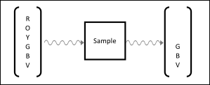
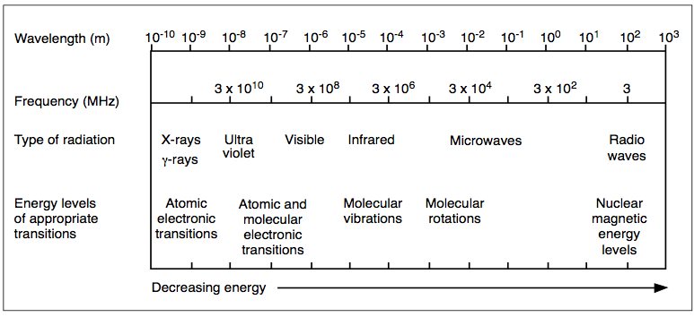
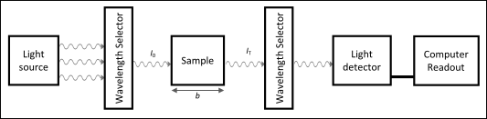
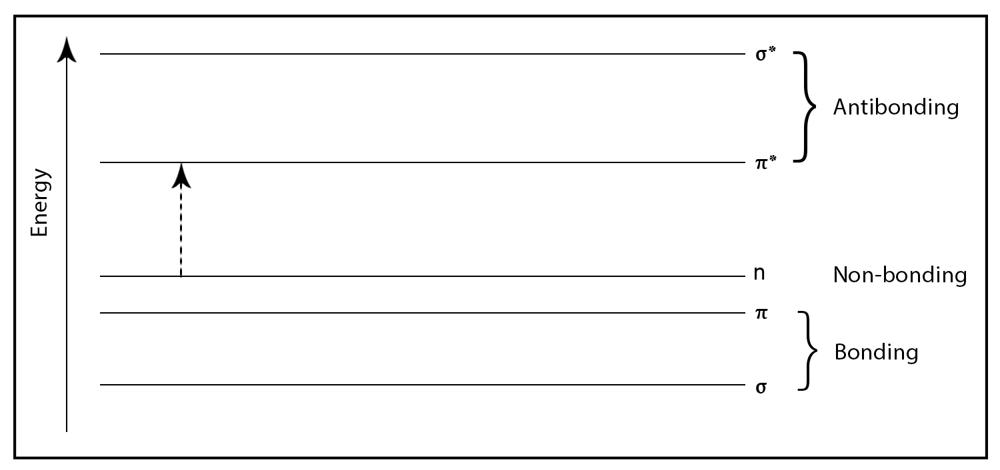

# Introdution to Molecular Spectroscopy

Spectroscopic methods are some of the most robust and ubiquitous in the scientific disciplines. Chemists, biologists, health professionals, neuroscientists, geologists, and more, all use spectroscopic techniques to study the systems that interest them. As a result, it is critical that you develop a thorough background in the fundamentals of spectroscopy and spectrophotometers as you move forward with your careers in the sciences. The goal of this guided workshop is to give you skills and experience working with spectroscopy to study molecular problems, and to help you to understand the nature of light/matter interactions in molecules. Work with your lab partner and your teaching assistants towards reaching these goals.

The workshop is comprised of two components: a pre-lab assignment based on the introductory material and a step-by-step workshop through three spectroscopy applications. The pre-lab assignment is due before arriving in lab. The remainder of the workshop is done in groups in the lab, with your lab instructor as a resource to help you in improving your understanding. The in-lab worksheet will be due before you leave the lab. Note: you do not need to prepare a lab notebook for this workshop; rather, you should work directly from the workshop and answer in the spaces provided.

## Light and its interactions with matter 

When light interacts with matter there are a number of possible outcomes: absorption, reflection, refraction, scattering, and transmission. While reflection, refraction, and scattering are all interesting phenomena, we will focus solely on absorption, transmission, and emission of light.

The colors of the solutions that we observe are not the light that is absorbed, rather the light that is transmitted -- a colorless solution is one for which all light is transmitted and none is absorbed. Note: a very common misconception is that the color we observe is that of *reflected* light. While that is true for opaque solids, the color of solutions is due to *transmitted* light. Consider the cartoon in [Figure 1](#fig:absorptionillustration): a sample is exposed to broad spectrum visible light (red, orange, yellow, green, blue, violet) and some of the light is absorbed (red, orange, and yellow). The transmitted light wavelengths are green, blue, and violet. As a result, the solution will appear blue, because the light at the red end of the spectrum is absorbed.

**Figure 1** - Illustration of absorption/transmission and the color of solutions. The solution appears blue.

Light is absorbed when it is in resonance with a transition in the atom or molecule, meaning that the frequency of the light is the same as the fundamental frequency of the molecular or atomic electronic oscillations. For example, when infrared (IR) light is absorbed, molecules begin to vibrate; when microwave radiation is absorbed, molecules begin to rotate; when visible light is absorbed, electrons in the valence shell are excited into an excited state; and more. The frequency of the radiation is what determines what resonances and transformations occur in the matter; see [Figure 2](#fig:EMspectrum).

**Figure 2** - Electromagnetic spectrum in order of decreasing energy, and the types of transitions associated with absorption of light at these frequencies.

As we know, light only transfers energy in quantized amounts known as photons. The photon energy, $$E_{\rm photon}$$, is the total amount of energy that the oscillating electric field from light needs to use in order to fully affect a change in the matter (i.e., to excite the matter):

$$E_{\rm photon} =h\nu=\frac{hc}{\lambda} \tag{1}$$

where $$\nu$$ is the frequency of the light, $$h$$ is Planck's constant ($$6.626 \times 10^{-34} \, {\rm J\cdot s}$$), $$c$$ is the speed of light ($$2.9979 \times 10^8 \, {\rm m \cdot s^{-1}}$$), and $$E_{\rm photon}$$ is the amount of energy that is transferred when light causes something to start "moving" at its resonant frequency, $$\nu$$.

The energies of the light in UV and visible light region of the spectrum are of the same magnitude as the energy differences between electronic energy levels in atoms and molecules. Consequently, when the light interacts with the molecules of interest, provided there is resonance, then light is absorbed causing the electron cloud in the ground state ($$S_0$$) to be transformed into an electron cloud corresponding to an excited state ($$S_1$$). The nature of the electrons in question, and the energy difference between their ground and excited states, will determine precisely which frequencies (wavelengths) of light will be absorbed.

## Anatomy of absorption spectrophotometers 

The actual internal components of a spectrophotometer are highly dependent on the type (UV/Vis, AA, fluorescence, IR, etc.) and model, and they include things like beam splitters, mirrors, lenses, and much more. That said, most absorption spectrophotometers have five key components that are common to all instruments: light source, wavelength selectors (monochromators), sample, detector, and readout; see [Figure 3](fig:boxdiagram-spectrometer).

The primary function of an absorption spectrophotometer is to measure the *transmittance*, $$T$$, of *monochromatic* light through a sample:

$$T = \frac{I_{\rm T}}{I_0} \tag{2}$$

where $$I_0$$ is the intensity of the incident light that hits the sample and $$I_{\rm T}$$ is the intensity of the light that is transmitted through the sample -- i.e., the light that is not absorbed, reflected, or refracted by the sample. Since most *light sources* give off a spectrum of light, a *monochromator* (wavelength selector in Figure ) is used to isolate a single wavelength of light to be studied at any given time.

Note: these instruments are designed to minimize the reflection and refraction of light, and the blank solutions we use compensate for this as well, so we will assume that any light not transmitted by the sample is in-fact absorbed. The theoretical maximum value for the transmittance of a sample is 1 (100%, all light transmitted) and the minimum value is 0 (0%, no light transmitted).

**Figure 3** - Box diagram for a spectrophotometer showing the key components: light source, two monochromators, sample, detector, and readout.

## Beer-Lambert's Law relates light absorbance to solute concentration 

In general, spectrophotometers rarely report transmittance of a sample; rather, they typically report the absorbance, $$A$$, of a sample, which is a derived quantity related to the logarithm of the transmittance:

$$A=-\log T=-\log \left( \frac{I_T}{I_0} \right) \tag{3}$$

The importance of the absorbance is found in that it directly relates to the concentration of the absorbing species in the sample. This relationship is known as the Beer-Lambert Law, or Beer's Law, and is given by the equation:

$$A=\varepsilon b c \tag{4}$$

where $$A$$ is the absorbance, $$c$$ is the molar concentration of the absorbing species (in moles/L), $$b$$ is the pathlength of the sample (usually in cm), and $$\varepsilon$$ is the molar absorptivity. The molar absorptivity, sometimes referred to as the molar extinction coefficient, is a measure of how much light of a specific wavelength will be absorbed by a specific chemical species, and $$\varepsilon$$ is an intrinsic property of that species at that wavelength.

Many students mistakenly relate the energy of the transition to the amount of photons absorbed (or the height of the peak). In reality, the energy of the transition is related **only** to the location (frequency or wavelength) of the peak, and the height of the peak is affected only by the molar extinction coefficient. Note, as well, that because $$A$$ is dimensionless (has no units), the units of $$\varepsilon$$ must be $${\rm L \, mol^{-1} cm^{-1}}$$ (or $${\rm M^{-1} cm^{-1}}$$).

### Derivation of Beer's law 

This theoretical derivation is optional, recommended reading. Absorption is the process by which the incident light intensity decreases as it passes through the sample with length $$b$$, surface area $$s^2$$, and molar concentration $$c$$. The instantaneous rate of change of the light intensity after passing through $$x$$ ($$x \le b$$) distance of the sample is written as:

$$\frac{dI}{dx} = -kN_As^2cI \tag{5}$$

where $$k$$ is some constant that relates the ability of the sample to absorb light, and $$N_A c$$ is the product of the molar concentration and Avogadro's number (i.e., the number of molecules per liter). (In other words, $$N_A c s^2 dx$$ is the number of light-absorbing particles the light encounters in the volume $$s^2 dx$$ and $$k$$ is related to the probability that one absorbs light.) Rearranging [equation 5](#eq:bld1a) into an integrable form and integrating we get:

$$\begin{split}
\frac{dI}{I} & = -k N s^2 c dx = -k^{\prime} c dx \\
 \\
\int_{I_0}^{I_b}\frac{dI}{I} &= -k^{\prime} c\int_{0}^{b}dx \\
 \\
\ln \frac{I_b}{I_0} &= -k^{\prime}bc \\
 \\
2.303\log \frac{I_b}{I_0} &= -k^{\prime}bc
\end{split}$$
$$\tag{6}$$

where $$I_b$$ is the light intensity that emerges from the sample (i.e., $$I_T$$) and $$k^{\prime}$$ is the constant of proportionality between the logarithm of the light intensity and the concentration of the solution. Substituting $$I_T$$ for $I_b$ into [equation 6](#eq:bld2a) and rearranging we get:

$$\log \frac{I_T}{I_0} = -\frac{k^{\prime}}{2.303} bc = -\varepsilon bc \equiv -A. \tag{7}$$

Notice, that replacing the constant of proportionality ($$k^{\prime}/2.3$$) with the molar absorptivity, $$\varepsilon$$, we arrive at Beer's Law, $$A = \varepsilon bc = -\log(I_T/I_0)$$.

For low-concentration solutions, where the molar absorptivity remains constant, Beer's Law holds true. As solution concentrations increase, however, the molar absorptivity can begin to change. Making a calibration curve and assessing its linearity is the only way to guarantee that you are working with solutions that are obeying Beer's Law.

## Molecules have different electronic states than atoms 

The colors that certain compounds, both organic and inorganic, make in solution are a direct consequence of their molecular electronic structures. Similar to the atomic spectroscopy that you may have seen previously (gas discharge tubes, "flame tests") in which atoms absorb and emit light as their electron cloud is excited from the ground state (and excited atoms give off light as they relax back to the ground state), molecules also absorb light in the ultraviolet (180 - 380 nm) and visible (380 - 900 nm) regions of the electromagnetic spectrum. In order to ensure that the majority of electronic transitions are observed when doing UV/Vis spectroscopy, the absorption spectrum is usually recorded from 180 to 900 nm.

The ground state electronic configuration of atoms and atomic ions is discussed at length in your textbook, and is something that you have spent a good amount of time studying. In general, the same principles apply to molecules, except that we are discussing molecular "orbitals" (electron clouds) instead of atomic "orbitals" (electron clouds[^1]). The Pauli exclusion principle (no two electrons can have identical quantum numbers), the Aufbau principle (electron clouds will be lower energy before they are higher energy), and Hund's rule all apply to molecules as well.

[^1]: It is important to remember that electrons do not behave as particles in atoms and molecules. Rather, they behave as waves or clouds -- this is the only model that explains the properties observed for electrons. So when we say the 2p "orbital" we are really describing an electron wave with a dumbell shape (i.e., p shape) and energy corresponding to $$n=2$$. The orbital is **not** *where* the electron is found. The orbital *is* the electron.

For molecules, the valence electrons form one of three types of orbitals: single bonding ($$\sigma$$) orbitals, double or triple bonding ($$\pi$$) orbitals, or non-bonding (n) orbitals. Sigma bonding orbitals are always lower in energy than $$\pi$$ bonding orbitals, which in turn are lower in energy than non-bonding (i.e., lone pair) orbitals. When electromagnetic radiation of the correct frequency is absorbed, a transition occurs from one of these orbitals to an empty orbital, usually a higher-energy anti-bonding orbital ($$\sigma^*$$ or $$\pi^*$$). [Figure 4](#fig:MOelectronictransition) depicts a typical molecular electronic transition, from a non-bonding molecular orbital (n) to the $$\pi^*$$-antibonding molecular orbital. Note: while the diagram in [figure 4](#fig:MOelectronictransition) only depicts one of each type of molecular orbital ($$\sigma$$, $$\pi$$, etc.), a molecule will almost always have many of each of these orbitals.

**Figure 4** - Hypothetical molecular orbital diagram with a typical molecular electronic transition ($$n \to \pi^*$$) shown.

The exact energy differences between the orbitals depend on the atoms present and the nature of the bonding system. In general, transitions from $$\sigma$$ bonding orbitals (or ending in $$\sigma^*$$ antibonding orbitals) are of too high a frequency (too short a wavelength) to be in the UV or visible region of the spectrum. As such, most of the UV/Vis absorptions in molecules involve only $$\pi \to \pi^*$$ or $$n \to \pi^*$$ transitions. A common exception to this is the d $$\to$$ d transition of d-block element complexes that will be discussed in section .

## Absorption of light by metal ion complexes 

Uncomplexed, or "free", metal ions do not absorb light in the visible region of the spectrum, because the transition between the highest occupied atomic orbital and the lowest unoccupied atomic orbital is at too short a wavelength (too high an energy) to be in the visible region of the spectrum. For that reason, we might expect that solutions of metal ions would be clear and colorless.

![A generic octahedral complex with formula $${\rm [M(H_2 O)_6^+]}$$, where M is a transition metal ion and there are six water ligands.](imgs/workshop_complex.svg)

**Figure 5** - A generic octahedral complex with formula $${\rm [M(H_2 O)_6^+]}$$, where M is a transition metal ion and there are six water ligands.

In reality, however, many metal ion solutions do have colors. The appearance of color in solutions of metal ions is a result of the complexation reaction that happens between the metal ion and water:

$${\rm M^+} (aq) + 6 {\rm H_2 O} (aq) \rightleftharpoons {\rm [M(H_2 O)_6^+]} (aq) \tag{8}$$

where $${\rm M^+}$$ is the metal ion, and six water molecules complex to the metal ion to make the octahedral complex ion $${\rm [M(H_2 O)_6^+]}$$ [Figure 5](#fig:complexion). Here, water is called a ligand (pronounced: lih-gand). Ligands are molecules or ions that coordinate to metal ions to form these coordination complexes.

In general, these complex ion formation equilibria (of the type in [equation 8](#eq:complexion)) are so product favored (i.e., $$K_{\rm eq}\gg 1$$) that the yield of the complex ion will be indistinguishable from 100%. Consequently, any time we are discussing solutions that contain things like $${\rm Zn^{2+}} (aq)$$, $${\rm Cu^{2+}} (aq)$$, or $${\rm Fe^{3+}} (aq)$$, what we are actually talking about is $$[{\rm Zn (H_2 O)_6^{2+}}] (aq)$$, $$[{\rm Cu (H_2 O)_6^{2+}}] (aq)$$, and $$[{\rm Fe (H_2 O)_6^{3+}}] (aq)$$.

So the question now becomes: if uncomplexed ions do not absorb visible light, what change has occurred during the complexation of ligands (water, in the examples above) that does lead to absorption of UV and visible light? The answer comes from a change that occurs in the energies of the 3d electron clouds once the ligands are bound to the metal. In gas-phase metal ions (also called the spherical ligand field), all five of the 3d orbitals are *degenerate* -- i.e., they have the same energy. In octahedral metal complex ions (also called the octahedral ligand field), on the other hand, the presence of the ligands has an effect on *some* of the 3d orbitals. The 3d orbitals that have the greatest overlap with the ligands will become higher energy because of the electronic repulsion. As a result, the energy levels of the 3d orbitals are split in the octahedral crystal field, because of the interaction between the metal ion's 3d orbitals and the ligands of the metal ion. This orbital splitting, also called crystal field splitting, can lead to electronic transitions in the visible region of the spectrum. This is called *Crystal Field Theory*.

## Lab Worksheet

Link to lab worksheet coming later!

## Footnotes